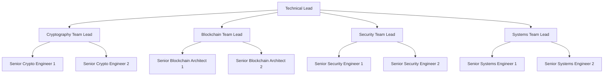
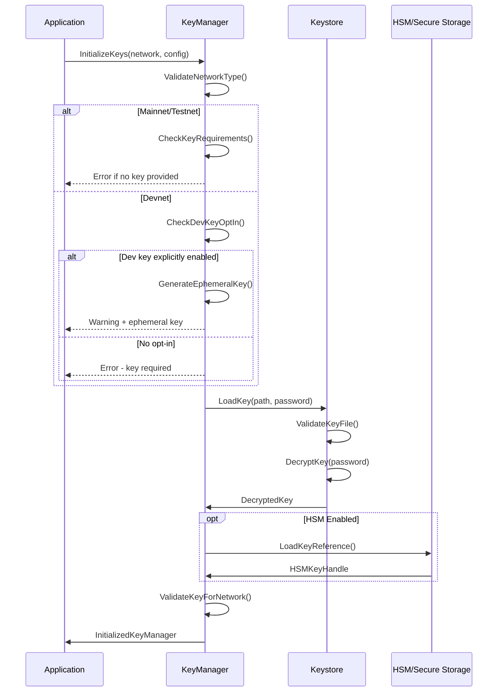
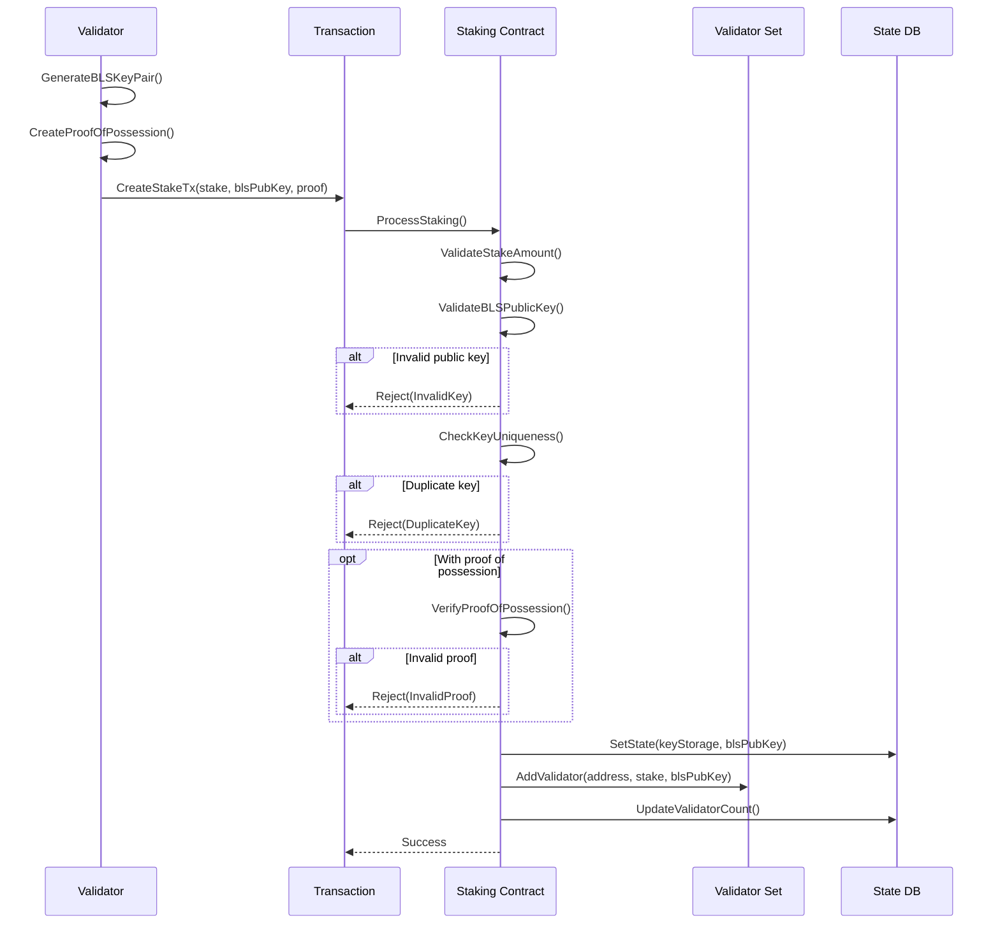
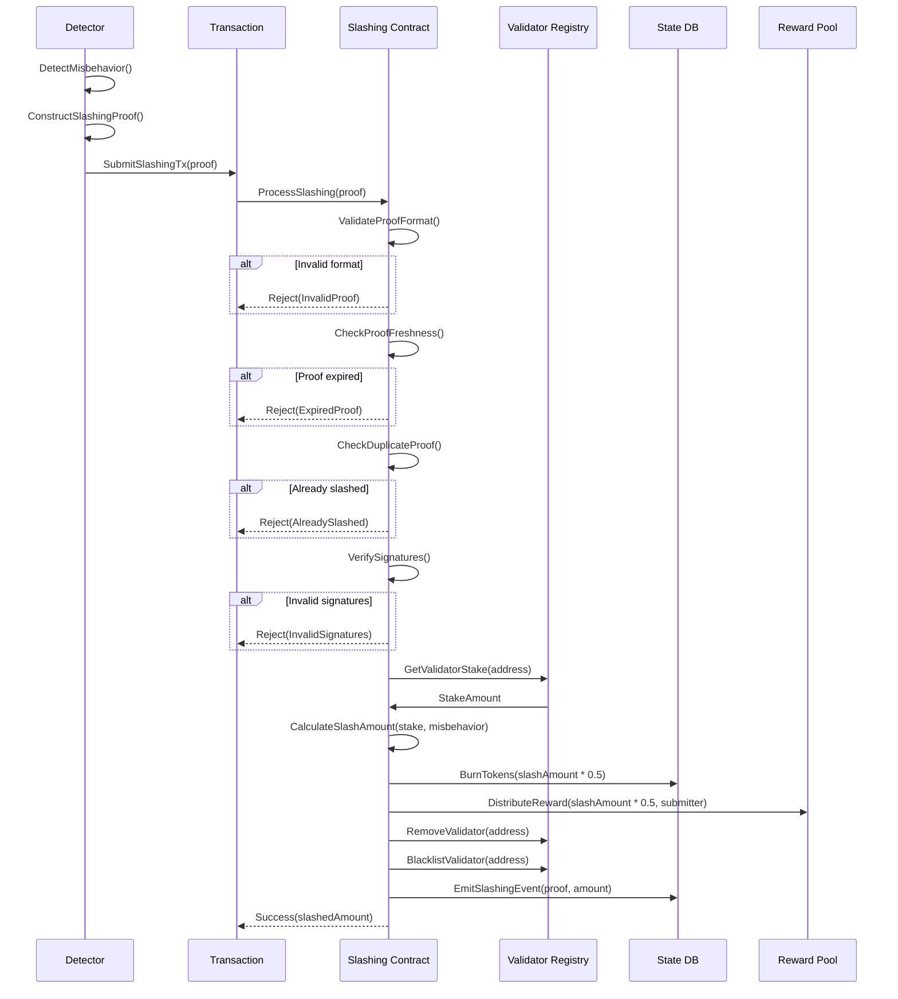
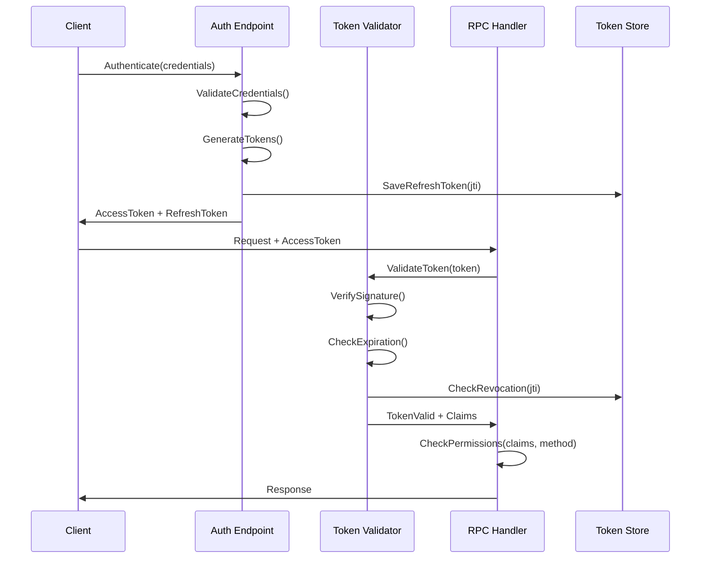
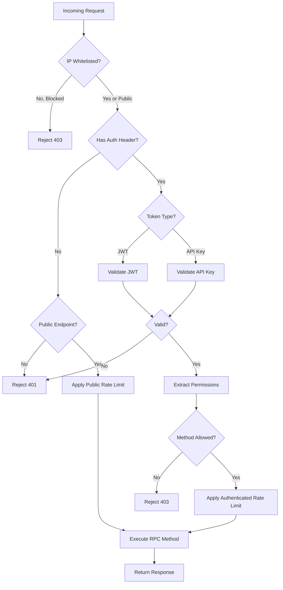
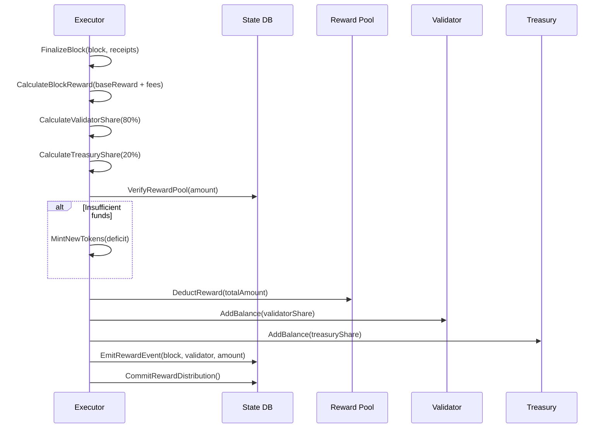
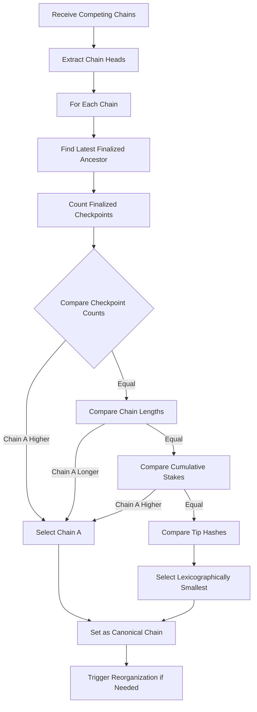
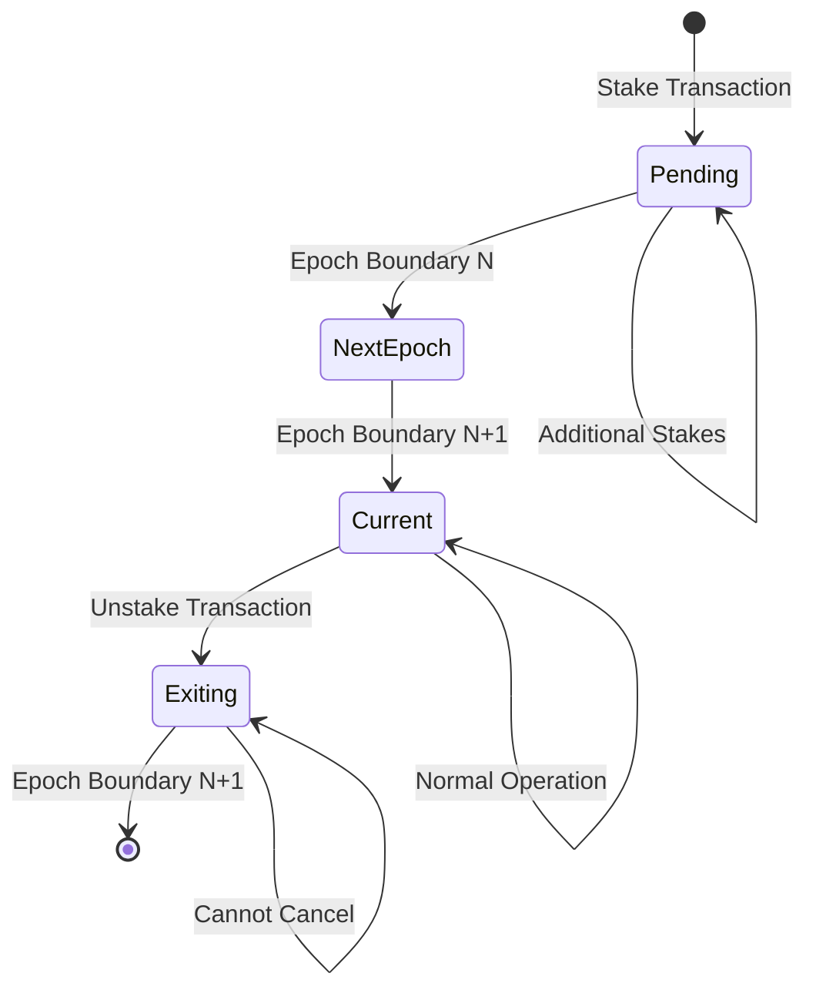
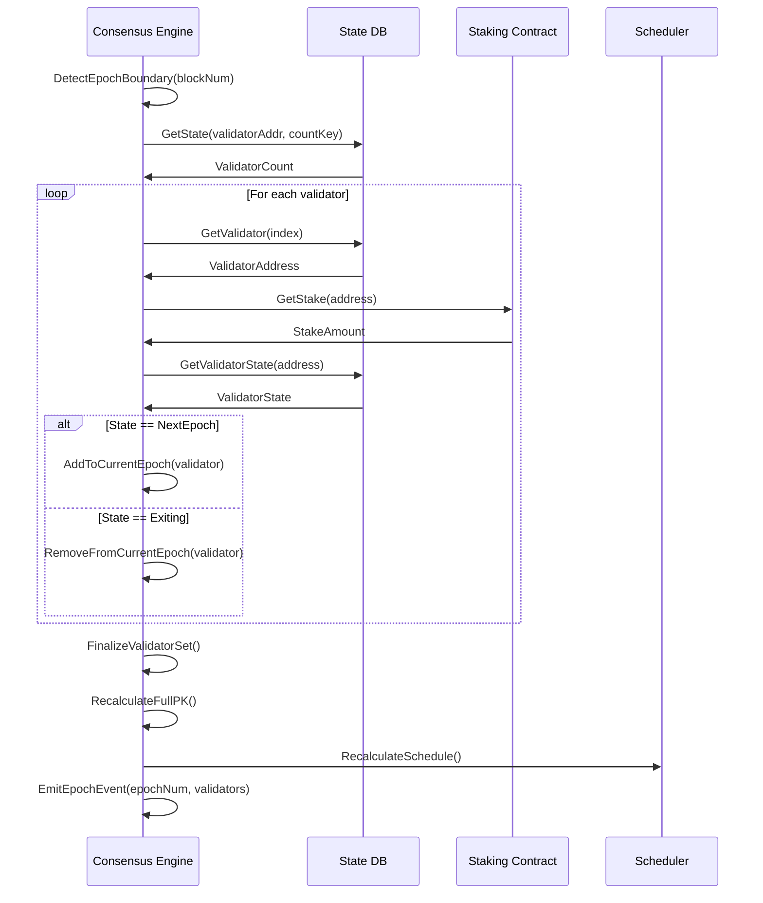

# Senior Go Development Team: Critical Security Fixes for Zephyria Blockchain

## Design Overview

This document defines the organization, responsibilities, and detailed implementation specifications for a senior Go development team tasked with resolving critical security vulnerabilities in the Zephyria blockchain. The team will implement production-ready solutions that address the five critical security vulnerabilities identified in the security audit, followed by high-priority consensus and networking issues.

## Team Structure and Responsibilities

### Team Composition

| Role | Count | Primary Responsibility |
|------|-------|------------------------|
| Technical Lead | 1 | Architecture decisions, code review, sprint coordination |
| Security Module Lead | 1 | Cryptographic systems, key management, slashing infrastructure |
| Consensus Module Lead | 1 | BLS signature aggregation, validator set management, fork choice |
| RPC/API Module Lead | 1 | Authentication, rate limiting, access control |
| System Contracts Lead | 1 | Reward distribution, staking contract security, access control |
| Integration Engineer | 1 | Cross-module integration, testing, deployment orchestration |

### Team Requirements

Each team member must possess:

- **Minimum 5 years** of production Go development experience
- Deep understanding of blockchain consensus mechanisms
- Experience with cryptographic systems (BLS, VRF, VDF)
- Production-level testing methodology (unit, integration, stress testing)
- Experience with distributed systems and P2P networking
- Familiarity with Ethereum-compatible architectures

## Development Approach

### Core Principles

1. **Zero Tolerance for Shortcuts**: Every implementation must be production-grade, not proof-of-concept
2. **Security First**: All code changes must undergo security review before merge
3. **Backward Compatibility**: Maintain compatibility with existing devnet/testnet deployments
4. **Comprehensive Testing**: Minimum 90 percent unit test coverage for critical modules
5. **Documentation**: Every security-critical function must have detailed inline documentation

### Development Workflow

**Phase Structure**

Each implementation phase follows this workflow:

| Step | Activities | Deliverables | Quality Gate |
|------|-----------|--------------|--------------|
| Design Review | Architecture discussion, API design, edge case analysis | Design document, API specification | Lead approval |
| Implementation | Code development, inline documentation, error handling | Functional code, unit tests | Self-review checklist |
| Security Review | Cryptographic verification, attack surface analysis | Security audit notes | Security lead sign-off |
| Testing | Unit tests, integration tests, fuzzing | Test suite, coverage report | 90%+ coverage |
| Code Review | Peer review, technical lead review | Approved PR | Two approvals required |
| Integration | Merge, integration testing, regression testing | Merged code | All tests passing |

## Phase 1: Critical Security Fixes

### Priority Order

The five critical vulnerabilities must be addressed in this strict order due to dependencies:

1. Hardcoded Private Keys
2. Deterministic BLS Key Generation  
3. Slashing Enforcement
4. RPC Authentication
5. Reward Contract Access Control

## Module 1: Secure Key Management System

### Objective

Eliminate all hardcoded cryptographic keys and implement a production-grade key management system with support for hardware security modules, encrypted keystores, and secure key derivation.

### Current Security Vulnerability

**Location**: `core/genesis.go:26`, `cmd/zephyria/main.go:60-67`

**Issue**: The system uses a hardcoded development private key as a fallback for all network types, including mainnet and testnet. Anyone with access to the codebase can compromise validator nodes and steal funds.

**Risk Level**: CRITICAL - Complete system compromise possible

### Design Solution

#### Architecture Components

| Component | Purpose | Technology |
|-----------|---------|------------|
| KeyManager | Central key management interface | Go interface with multiple implementations |
| EncryptedKeystore | File-based encrypted key storage | AES-256-GCM encryption, scrypt KDF |
| HSMKeystore | Hardware security module integration | PKCS11 interface support |
| MemoryKeystore | In-memory key storage (development only) | Secure memory wiping on cleanup |
| KeyDerivation | BLS key derivation from validator keys | RFC8032-compatible derivation |

#### Key Management Interface

The system shall provide a unified interface for all key operations:

**KeyManager Interface Specification**

The KeyManager interface defines operations for:
- Validator ECDSA key loading and storage
- BLS private key derivation
- Secure key unlocking with passphrase
- Key rotation and backup
- Hardware security module integration

**Key Storage Formats**

Three storage backends shall be supported:

| Backend | Use Case | Security Level | Configuration |
|---------|----------|----------------|---------------|
| Encrypted File | Production validators | High | File path, passphrase required |
| HSM/PKCS11 | Enterprise deployments | Very High | HSM module path, slot ID, PIN |
| Memory Only | Development/testing | Low | Keys provided at startup, not persisted |

#### Keystore File Format

Encrypted keystores shall use the Ethereum-compatible UTC/JSON keystore format:

**File Structure**

The keystore file contains:
- Version identifier (currently version 3)
- Unique identifier (UUID v4)
- Wallet address derived from public key
- Encrypted private key using AES-128-CTR cipher mode
- Key derivation function parameters (scrypt with N=262144, r=8, p=1)
- Message authentication code (MAC) using Keccak256

**Security Properties**

- **Encryption**: AES-256-GCM authenticated encryption
- **Key Derivation**: scrypt with parameters N=262144, r=8, p=1 (resistant to GPU attacks)
- **Authentication**: MAC verification prevents tampering
- **Passphrase Strength**: Minimum 12 characters enforced, entropy checking recommended

#### Key Derivation Strategy

**BLS Key Derivation from Validator Keys**

Instead of deterministic address-based derivation (current vulnerability), the system shall derive BLS keys securely from the validator's ECDSA private key:

**Derivation Process**

1. Extract validator ECDSA private key bytes
2. Apply HKDF-SHA256 with domain separation constant "ZEPHYRIA-BLS-DERIVATION-V1"
3. Use 32-byte output as BLS private key scalar
4. Compute BLS public key via scalar multiplication on G1

**Domain Separation**

Each key type uses a distinct domain separator:
- Validator signing: "ZEPHYRIA-VALIDATOR-KEY-V1"
- BLS consensus: "ZEPHYRIA-BLS-DERIVATION-V1"
- VRF randomness: "ZEPHYRIA-VRF-KEY-V1"

This prevents cross-protocol attacks and key reuse vulnerabilities.

#### Network-Specific Key Requirements

**Mainnet Requirements**

- Private key MUST be provided via encrypted keystore or HSM
- No default keys permitted
- Node refuses to start without explicit key configuration
- Warning logged if key file permissions are too permissive (not 0600)

**Testnet Requirements**

- Private key MUST be provided (encrypted keystore recommended)
- Development key allowed only with explicit --unsafe-dev-key flag
- Warning banner displayed on startup if using development key
- Rate limiting enforced to prevent abuse

**Devnet Requirements**

- Development key permitted as default
- Warning banner still displayed
- Explicit flag --devnet-insecure-key required to suppress warnings

#### Implementation Specifications

**Startup Key Loading Sequence**

The node startup process shall implement this key loading logic:

1. Parse command-line flags for key configuration
2. Determine network type (mainnet, testnet, devnet)
3. Check if keystore path provided via --keystore flag
4. If mainnet or testnet and no keystore: FATAL ERROR - refuse to start
5. If keystore provided: prompt for passphrase (or read from --password-file)
6. Load and decrypt keystore file
7. Derive BLS keys from loaded ECDSA key
8. Register keys with consensus engine
9. Validate key matches expected validator address if specified

**Error Handling Requirements**

| Error Condition | Handling Strategy | User Feedback |
|-----------------|-------------------|---------------|
| No key on mainnet | Immediate exit with error code 1 | "FATAL: Private key required for mainnet. Use --keystore flag" |
| Invalid keystore format | Exit with error code 2 | "ERROR: Keystore file corrupted or invalid format" |
| Wrong passphrase | Exit with error code 3 | "ERROR: Incorrect passphrase for keystore" |
| Key file permissions too open | Warning only (start anyway) | "WARNING: Keystore file permissions should be 0600" |
| HSM connection failed | Exit with error code 4 | "ERROR: Cannot connect to HSM device" |

**Configuration File Structure**

The system shall support TOML configuration files for key management:

**Key Management Configuration**

The configuration file specifies:
- Keystore backend type (file, hsm, memory)
- Path to keystore file or HSM library
- Optional password file path (not recommended for production)
- Key rotation schedule and backup configuration
- Audit logging settings for key operations

#### Security Audit Requirements

Before deployment, the Key Management module must pass:

1. **Cryptographic Review**: Verification of encryption algorithms, key derivation functions, and secure random number generation
2. **Access Control Review**: Ensure no unauthorized key access paths
3. **Memory Safety Review**: Verify secure memory wiping of sensitive data
4. **File System Security**: Verify proper file permissions and atomic write operations
5. **Fuzzing**: 100,000+ iterations of keystore file parsing with malformed inputs

#### Testing Requirements

**Unit Tests**

- Keystore encryption and decryption roundtrip
- Passphrase strength validation
- BLS key derivation determinism
- HSM connection and operation mocking
- Error handling for all failure modes

**Integration Tests**

- End-to-end key loading from encrypted file
- Node startup with various key configurations
- Key rotation without service interruption
- HSM failover scenarios

**Security Tests**

- Passphrase brute force resistance (timing attack prevention)
- Memory dump analysis (verify key wiping)
- File permission bypass attempts
- Concurrent access safety

### Implementation Checklist

- [ ] Define KeyManager interface with all required methods
- [ ] Implement EncryptedFileKeystore with UTC/JSON format
- [ ] Implement HSMKeystore with PKCS11 support
- [ ] Implement secure BLS key derivation (HKDF-based)
- [ ] Add network-specific validation (mainnet key enforcement)
- [ ] Update cmd/zephyria/main.go to use new KeyManager
- [ ] Remove DefaultDevKey constant from core/genesis.go
- [ ] Add configuration file parser for keystore settings
- [ ] Implement passphrase strength validator
- [ ] Add secure memory wiping for key material
- [ ] Implement key rotation mechanism
- [ ] Add audit logging for all key operations
- [ ] Create keystore CLI utility for key generation and import
- [ ] Write comprehensive test suite (90%+ coverage target)
- [ ] Perform security audit of implementation
- [ ] Update documentation with key management guide

## Module 2: BLS Key Registration System

### Objective

Replace deterministic BLS key generation with a secure registration system where validators provide their own BLS public keys during staking, eliminating the critical vulnerability where all validator keys are publicly computable.

### Current Security Vulnerability

**Location**: `consensus/zelius.go:215-216`, `consensus/zelius.go:637-641`, `core/genesis.go:226-228`

**Issue**: BLS private keys are derived deterministically from validator addresses using Keccak256 hash. Any attacker can compute all validator private keys, forge signatures, and produce fraudulent blocks.

**Attack Scenario**:
1. Attacker reads validator address from blockchain state
2. Computes: `sk = Keccak256(validatorAddress)`
3. Derives BLS public key: `pk = sk * G1`
4. Signs arbitrary blocks with compromised key
5. Network accepts fraudulent signatures as valid

**Risk Level**: CRITICAL - Complete consensus compromise

### Design Solution

#### Architecture Overview

The new system separates BLS key management from validator addresses:

| Component | Responsibility |
|-----------|----------------|
| BLS Key Generator | Off-chain utility for validators to generate secure BLS key pairs |
| Staking Contract Extension | Accept and store BLS public keys during stake deposits |
| Key Registry | On-chain storage mapping validator addresses to BLS public keys |
| Consensus Engine Update | Load registered BLS keys instead of deriving them |
| Key Rotation Protocol | Support for validators to update their BLS keys |

#### BLS Key Generation Protocol

**Secure Key Generation Process**

Validators shall generate BLS key pairs using:

1. **Entropy Source**: System random number generator with at least 256 bits of entropy
2. **Key Generation**: Sample random scalar from BLS12-381 curve's scalar field
3. **Public Key Derivation**: Multiply base point G1 by secret scalar
4. **Key Verification**: Verify public key is valid curve point (not point at infinity)
5. **Key Storage**: Store private key in encrypted keystore, public key submitted on-chain

**Key Generation Utility**

A CLI tool shall be provided for validators:

**BLS Key Generation Utility**

The utility provides:
- Generation of secure BLS key pairs
- Export of public key in hex format for staking transaction
- Encrypted private key storage in keystore file
- Key import from existing keystores
- Public key verification and display

#### Staking Contract Enhancement

**Updated Staking Transaction Format**

The staking contract must be extended to accept BLS public keys:

**Staking Transaction Data Structure**

Transaction data field shall contain:
- Operation type: "STAKE" (4 bytes ASCII)
- BLS public key: 48 bytes compressed G1 point
- Optional metadata: validator name, contact info (variable length)

**Total minimum data length**: 52 bytes (4 + 48)

**Validation Rules**

The staking contract shall enforce:

| Validation | Rule | Rejection Reason |
|------------|------|------------------|
| Data length | Minimum 52 bytes | "Invalid stake data: BLS key required" |
| BLS key format | Valid compressed G1 point | "Invalid BLS public key format" |
| Key uniqueness | BLS key not already registered | "BLS key already in use by another validator" |
| Stake amount | Greater than minimum stake threshold | "Insufficient stake amount" |
| Address uniqueness | Validator address not already staked | "Address already staking" |

**Compressed G1 Point Format**

BLS public keys use BLS12-381 G1 point compression:
- 48 bytes total
- First byte contains compression flag and sign bit
- Remaining 47 bytes contain x-coordinate
- y-coordinate reconstructed during decompression

#### On-Chain Key Registry

**State Storage Layout**

The validator contract stores BLS keys in state:

**Key Registry State Schema**

| Storage Key | Value | Purpose |
|-------------|-------|---------|
| keccak256(validatorAddr, "BLS_KEY") | 48-byte BLS public key | Retrieve validator's BLS key |
| keccak256(blsPubKey, "OWNER") | Validator address | Prevent key reuse |
| keccak256("VALIDATOR_COUNT") | Validator count | Track total validators |
| keccak256("VALIDATOR_LIST", index) | Validator address | Iterate validators |

**Key Registration Process**

When a stake transaction is processed:

1. Extract BLS public key from transaction data
2. Validate key format (48 bytes, valid G1 point)
3. Check key not already registered (query OWNER mapping)
4. Store key in registry: State[ValidatorAddr]["BLS_KEY"] = blsPublicKey
5. Store reverse mapping: State[blsPublicKey]["OWNER"] = validatorAddr
6. Add validator to active set if stake threshold met

#### Consensus Engine Integration

**SyncValidators Function Redesign**

The consensus engine must load registered BLS keys from state instead of deriving them:

**Key Loading Algorithm**

The validator synchronization process:

1. Query validator count from ValidatorAddr contract
2. Iterate through validator list (indices 1 to count)
3. For each validator address:
   - Query stake amount from StakingAddr contract
   - Query BLS public key from ValidatorAddr contract (key: keccak256(addr, "BLS_KEY"))
   - Validate BLS key is non-zero (48 bytes, not all zeros)
   - Construct Validator struct with {Address, Stake, BLSPubKey}
4. Replace engine's validator set with loaded list
5. Recalculate aggregate BLS public key
6. Update leader schedule cache

**Missing Key Handling**

If a validator has stake but no BLS key registered:

| Scenario | Action | Rationale |
|----------|--------|-----------|
| Legacy validator (pre-upgrade) | Log warning, skip validator | Prevent consensus failure during migration |
| New validator missing key | Refuse stake transaction | Enforce key registration |
| Key registration failed | Validator inactive, stake locked | Data corruption detection |

#### Key Rotation Protocol

**Motivation**: Validators may need to rotate keys if compromised or for security hygiene.

**Rotation Process**

The system shall support key rotation via special transaction:

**Key Rotation Transaction**

Transaction structure:
- Destination: StakingAddr (0x1000)
- Value: 0 (no additional stake)
- Data: "ROTATE_BLS_KEY" + new 48-byte BLS public key
- Signature: Signed by current validator key

**Rotation Validation**

The system enforces:
- Only current validator can initiate rotation
- New key must be different from current key
- New key must not be registered to another validator
- Rotation only allowed once per epoch (prevent spam)
- Old key immediately invalidated after rotation

**Consensus Handling**

Key rotations take effect at epoch boundaries:
- Rotation submitted in epoch N
- Becomes active at start of epoch N+1
- Blocks signed in transition period: accept both old and new keys
- Full migration complete after epoch N+1 begins

#### Genesis Validator Initialization

**Genesis Block Considerations**

For the genesis block and initial validator set:

**Genesis Validator BLS Key Initialization**

Options for genesis validators:

| Approach | Security | Deployment Complexity |
|----------|----------|----------------------|
| Pre-generated keys in config | Medium (keys in config file) | Low |
| Deterministic derivation (temporary) | Low (but time-limited) | Low |
| Manual registration before genesis | High (keys never in config) | Medium |

**Recommended Approach**: Manual registration

Genesis process:
1. Validators generate BLS keys offline
2. Submit public keys to genesis coordinator
3. Genesis coordinator includes keys in genesis state
4. Genesis block includes BLS keys in ValidatorAddr contract storage
5. No deterministic derivation ever occurs

**Migration Path for Existing Chains**

For chains already deployed with deterministic keys:

**Upgrade Migration Strategy**

Phase 1 (Soft Fork - Block N):
- Accept both derived keys (legacy) and registered keys (new)
- Log warnings for validators still using derived keys
- Staking contract updated to accept BLS key parameter

Phase 2 (Transition - Blocks N to N+10000):
- Grace period: validators submit key rotation transactions
- Consensus accepts legacy derived keys with deprecation warnings
- New validators MUST provide BLS keys

Phase 3 (Hard Fork - Block N+10000):
- Consensus REJECTS legacy derived keys
- All validators must have registered BLS keys
- Deterministic derivation code removed entirely

#### Implementation Specifications

**BLS Key Validation Function**

The system shall implement strict BLS key validation:

**BLS Key Validation Rules**

The validator checks:
- Length is exactly 48 bytes (compressed G1 point)
- First byte compression flag is valid (0x80 or 0xC0)
- Point decompression succeeds (valid curve point)
- Point is not the identity element (point at infinity)
- Point is in the prime-order subgroup (cofactor clearing)

**Error Codes**

| Error Code | Meaning | User Action |
|------------|---------|-------------|
| ERR_BLS_KEY_INVALID_LENGTH | Key not 48 bytes | Regenerate key |
| ERR_BLS_KEY_INVALID_FORMAT | Decompression failed | Check key integrity |
| ERR_BLS_KEY_IDENTITY | Key is point at infinity | Regenerate key |
| ERR_BLS_KEY_WRONG_SUBGROUP | Point not in correct subgroup | Regenerate key |
| ERR_BLS_KEY_ALREADY_USED | Key registered to another validator | Use unique key |

**Staking Contract Code Changes**

The ProcessStaking function must be updated:

**Staking Logic Update**

Current flow:
1. Check transaction value > 0
2. Store stake: State[StakingAddr][senderHash] = value
3. Add to validator list

New flow:
1. Check transaction value > 0
2. Extract BLS key from transaction data (bytes 4-52)
3. Validate BLS key format and uniqueness
4. Store stake: State[StakingAddr][senderHash] = value
5. Store BLS key: State[ValidatorAddr][keccak256(sender, "BLS_KEY")] = blsKey
6. Store reverse mapping: State[ValidatorAddr][keccak256(blsKey, "OWNER")] = sender
7. Add to validator list

**Unstaking Logic Update**

When unstaking, the system must:
- Remove stake from StakingAddr
- Preserve BLS key in ValidatorAddr (for slashing history)
- Mark validator as inactive
- Allow key reuse only after unbonding period

#### Testing Requirements

**Unit Tests**

- BLS key validation for all error conditions
- Key registration with valid and invalid keys
- Key uniqueness enforcement
- Key rotation transaction validation
- Unstaking preserves key in registry

**Integration Tests**

- End-to-end stake with BLS key submission
- Consensus engine loads registered keys correctly
- Key rotation at epoch boundary
- Genesis validator initialization
- Migration from legacy to registered keys

**Security Tests**

- Attempt to register duplicate BLS keys (should fail)
- Attempt to rotate key without validator authorization (should fail)
- Attempt to use derived keys after hard fork (should fail)
- Fuzz testing: invalid BLS key formats
- Stress test: 10,000 validators with unique BLS keys

**Backward Compatibility Tests**

- Legacy nodes reject blocks signed with unregistered keys
- New nodes accept genesis blocks with registered keys
- Soft fork transition: mixed validator set

### Implementation Checklist

- [ ] Implement BLS key validation function with all security checks
- [ ] Create BLS key generation CLI utility
- [ ] Extend staking contract to accept BLS public keys in transaction data
- [ ] Add key registry state storage in ValidatorAddr contract
- [ ] Update ProcessStaking function to store registered BLS keys
- [ ] Implement key uniqueness check (prevent reuse)
- [ ] Update SyncValidators to load registered keys from state
- [ ] Remove deterministic key derivation from zelius.go
- [ ] Implement key rotation transaction handler
- [ ] Add epoch-boundary key rotation activation
- [ ] Create genesis BLS key initialization process
- [ ] Implement migration strategy for existing chains
- [ ] Add BLS key validation error codes and messages
- [ ] Write comprehensive test suite (unit + integration)
- [ ] Perform security audit of BLS key handling
- [ ] Update documentation with key registration guide

## Module 3: Slashing Enforcement Infrastructure

### Objective

Implement a complete on-chain slashing system with cryptographic proof verification, economic penalties, and network-wide enforcement to prevent Byzantine behavior and double-signing attacks.

### Current Security Vulnerability

**Location**: `consensus/zelius.go:456-477`

**Issue**: Slashing is tracked locally per node but never synchronized across the network or enforced economically. A validator slashed on one node remains active on other nodes. No economic penalty is applied, making Byzantine attacks cost-free.

**Attack Scenario**:
1. Validator double-signs blocks at same height
2. Local node detects misbehavior and calls Slash()
3. Validator removed from local consensus engine
4. Other network nodes unaware of slashing
5. Validator continues participating on other nodes
6. No stake loss, no economic deterrent

**Risk Level**: CRITICAL - No Byzantine fault tolerance

### Design Solution

#### Architecture Overview

The slashing system consists of four core components:

| Component | Purpose | Consensus Requirement |
|-----------|---------|----------------------|
| SlashingProof | Cryptographic evidence of misbehavior | Must be verifiable by all nodes |
| SlashingContract | On-chain enforcement of penalties | State machine for slashing lifecycle |
| SlashingGossip | P2P propagation of slashing proofs | Flood-fill dissemination |
| SlashingProtection | Prevent self-slashing via local database | Validator-side defense |

#### Slashable Offenses

The system shall detect and punish these Byzantine behaviors:

| Offense | Detection Method | Penalty | Proof Required |
|---------|------------------|---------|----------------|
| Double Signing | Two blocks at same height with different hashes | 50% stake slash | Two conflicting block headers + signatures |
| Surround Voting | Vote spans that violate Casper FFG rules | 30% stake slash | Two conflicting vote attestations |
| Unjustified Block | Block without valid parent or VDF chain | 10% stake slash | Invalid block + verification proof |
| Censorship | Validator ignores valid transactions for multiple epochs | 20% stake slash | Transaction inclusion proof + epoch logs |

#### Slashing Proof Structure

**Double-Sign Proof Format**

The most common slashing proof (double signing) contains:

**Double-Sign Slashing Proof Schema**

| Field | Type | Size | Purpose |
|-------|------|------|---------|
| ProofType | uint8 | 1 byte | Slashing type identifier (0x01 = double-sign) |
| ValidatorAddress | address | 20 bytes | Accused validator's address |
| BlockHeight | uint64 | 8 bytes | Height where double-sign occurred |
| BlockHash1 | bytes32 | 32 bytes | First block hash |
| BlockHash2 | bytes32 | 32 bytes | Second block hash (must differ) |
| Signature1 | BLS signature | 96 bytes | BLS signature on block 1 |
| Signature2 | BLS signature | 96 bytes | BLS signature on block 2 |
| Timestamp | uint64 | 8 bytes | Proof submission time |
| Submitter | address | 20 bytes | Address of proof submitter (for rewards) |

**Total Proof Size**: 281 bytes

**Proof Validity Requirements**

A slashing proof is valid if and only if:

1. **Distinct Blocks**: BlockHash1 ≠ BlockHash2
2. **Same Height**: Both blocks claim the same BlockHeight
3. **Valid Signatures**: Both signatures verify against validator's registered BLS public key
4. **Signature Uniqueness**: Signature1 ≠ Signature2
5. **Temporal Validity**: Proof submitted within 7 days of offense (prevents stale slashing)
6. **Not Already Slashed**: Validator has not been previously slashed for this offense

#### Slashing Verification Algorithm

**Proof Verification Process**

The slashing contract implements this verification logic:

**Double-Sign Verification Steps**

1. **Load Validator State**
   - Query validator's stake from StakingAddr
   - Query validator's BLS public key from ValidatorAddr
   - Check validator is currently active (not already slashed)

2. **Validate Proof Structure**
   - Verify proof length matches expected 281 bytes
   - Verify block hashes are distinct (BlockHash1 ≠ BlockHash2)
   - Verify height values match in both blocks
   - Verify timestamps are within acceptable range

3. **Reconstruct Block Headers**
   - Extract ExtraData prefix (VDF + Round + VRF)
   - Reconstruct seal hash: Hash(Header with ExtraData prefix)
   - Verify seal hashes match claimed block hashes

4. **Verify BLS Signatures**
   - Hash block 1 seal hash to G2 curve point
   - Verify Signature1 using validator's BLS public key via pairing check
   - Hash block 2 seal hash to G2 curve point
   - Verify Signature2 using same BLS public key
   - Both verifications must succeed

5. **Check Proof Freshness**
   - Current block height - offense height ≤ 50400 blocks (7 days at 12s blocks)
   - Reject stale proofs to prevent DoS via old evidence

6. **Execute Slashing**
   - If all checks pass: slash validator
   - If any check fails: reject proof and emit error event

#### Slashing Execution

**Economic Penalty Structure**

When slashing is executed, the following state transitions occur:

**Slashing State Transitions**

| State Variable | Before | After | Change |
|----------------|--------|-------|--------|
| Validator Stake | Full stake amount | 50% of stake | Slashed 50% |
| Validator Status | Active | Slashed (permanently banned) | Blacklisted |
| Slashed Balance | 0 | 50% of stake | Credited to slashing pool |
| Submitter Reward | 0 | 1% of slashed stake | Incentivize honest reporting |
| Burn Amount | 0 | 49% of slashed stake | Remove from circulation |

**Slashing Penalty Formula**

For double-signing:
- Slash Amount = Stake × 0.50
- Submitter Reward = Slashed Amount × 0.02 (2% of slashed)
- Burn Amount = Slashed Amount - Submitter Reward
- Remaining Stake = Stake × 0.50 (returned after unbonding period)

**Blacklist Enforcement**

Slashed validators are permanently blacklisted:
- Address added to blacklist: State[ValidatorAddr]["BLACKLIST"][address] = true
- Cannot re-stake from same address
- BLS public key also blacklisted (prevent key reuse)
- Removed from active validator set immediately

#### Slashing Contract Implementation

**Contract State Schema**

The slashing contract maintains this state:

| Storage Key | Value Type | Purpose |
|-------------|------------|---------|
| keccak256("SLASHING_COUNT") | uint64 | Total slashing events |
| keccak256("SLASHING_EVENT", index) | SlashingEvent struct | Historical record |
| keccak256("BLACKLIST", address) | bool | Is address blacklisted |
| keccak256("SLASHED_AT_HEIGHT", height, address) | bool | Prevent duplicate slashing |
| keccak256("SLASHING_POOL") | uint256 | Total slashed funds awaiting distribution |

**SlashingEvent Structure**

Each slashing event is recorded:

**Slashing Event Record**

Fields stored:
- Event ID (sequential counter)
- Validator address (slashed party)
- Block height (where offense occurred)
- Proof type (double-sign, surround vote, etc.)
- Slashed amount (wei)
- Submitter address (who reported)
- Timestamp (when executed)
- Proof hash (for verification)

#### Slashing Gossip Protocol

**P2P Dissemination Strategy**

Slashing proofs must propagate quickly across the network:

**Gossip Protocol Specification**

| Property | Value | Rationale |
|----------|-------|-----------|
| Message Type | MsgSlashingProof (0x08) | Dedicated message type |
| Propagation | Flood-fill (forward to all peers) | Maximum reach, low latency |
| Deduplication | Proof hash tracking | Prevent redundant processing |
| Validation | Full verification before gossip | Prevent DoS via invalid proofs |
| Rate Limiting | Max 10 proofs per peer per minute | DoS protection |
| Priority | High (equivalent to block announcements) | Fast consensus convergence |

**Slashing Proof Message Format**

P2P message structure:

**Slashing Proof P2P Message**

Components:
- Message type identifier (1 byte)
- Proof data (281 bytes for double-sign)
- Signature by submitter (65 bytes ECDSA)
- Nonce (8 bytes, prevent replay)

Total message size: 355 bytes

**Gossip Handling Logic**

When a node receives a slashing proof message:

1. **Deduplication Check**
   - Compute proof hash: Keccak256(proof data)
   - Check if already seen: seenProofs[proofHash]
   - If seen: discard, do not re-gossip

2. **Rate Limit Check**
   - Check peer has not exceeded 10 proofs/minute
   - If exceeded: increase peer ban score, discard proof

3. **Signature Verification**
   - Verify submitter's ECDSA signature on proof
   - Reject unsigned or invalidly signed proofs

4. **Full Proof Verification**
   - Run complete double-sign verification (as described above)
   - Only gossip if proof is valid

5. **Local Slashing Execution**
   - Apply slashing to local state
   - Update validator set in consensus engine
   - Remove validator from active set

6. **Re-Gossip**
   - Forward proof to all connected peers (except sender)
   - Mark proof hash as seen

#### Slashing Protection Database

**Validator-Side Defense**

To prevent accidental self-slashing, validators maintain a local protection database:

**Protection Database Schema**

| Table | Columns | Purpose |
|-------|---------|---------|
| signed_blocks | height, block_hash, signature, timestamp | Record of all signed blocks |
| signed_votes | height, block_hash, checkpoint, signature, timestamp | Record of all votes |
| high_water_mark | slot_number | Highest slot ever signed (prevent reorg slashing) |

**Pre-Sign Checks**

Before signing any block or vote, validator checks:

1. **Height Check**: Has height already been signed?
   - Query: SELECT COUNT(*) FROM signed_blocks WHERE height = ?
   - If count > 0: REFUSE to sign (would be double-sign)

2. **Surround Check**: Would vote create surround violation?
   - Check if vote spans conflict with existing votes
   - Refuse if violation detected

3. **High Water Mark**: Is slot beyond previous maximum?
   - If new_slot <= high_water_mark and blocks differ: REFUSE
   - Update high_water_mark after successful sign

4. **Record Sign Event**
   - INSERT INTO signed_blocks (height, block_hash, signature, timestamp)
   - COMMIT transaction before releasing signature

**Database Backup**

The protection database is critical:
- Backup after every sign operation
- Store redundant copies (local + remote)
- Restore from backup on node restart
- Alert operator if database corrupted

#### On-Chain Slashing Contract Logic

**ProcessSlashing Function**

The executor must implement slashing transaction processing:

**Slashing Transaction Processing**

Transaction format:
- Destination: SlashingAddr (0x0000...5000 - new system contract)
- Value: 0 (no payment)
- Data: Serialized SlashingProof (281 bytes for double-sign)

Processing steps:

1. **Parse Proof**
   - Deserialize transaction data into SlashingProof struct
   - Validate proof structure (length, field types)

2. **Check Duplicate**
   - Key: keccak256("SLASHED_AT_HEIGHT", proof.BlockHeight, proof.ValidatorAddress)
   - If State[SlashingAddr][key] == true: reject (already slashed)

3. **Verify Proof**
   - Run full double-sign verification algorithm
   - Reject if any check fails

4. **Load Validator Stake**
   - Query stake: State[StakingAddr][validatorAddressHash]
   - If stake == 0: reject (validator not staked or already fully slashed)

5. **Calculate Penalty**
   - slash_amount = stake * 0.50
   - submitter_reward = slash_amount * 0.02
   - burn_amount = slash_amount - submitter_reward

6. **Execute Penalty**
   - Deduct from stake: State[StakingAddr][validatorAddressHash] = stake - slash_amount
   - Add to slashing pool: State[SlashingAddr]["SLASHING_POOL"] += burn_amount
   - Reward submitter: State[submitter_address].balance += submitter_reward

7. **Blacklist Validator**
   - Set blacklist flag: State[ValidatorAddr]["BLACKLIST"][validator_address] = true
   - Remove from active validator list (swap-and-pop)
   - Decrement validator count

8. **Record Event**
   - Increment slashing counter
   - Store SlashingEvent in state
   - Emit SlashingExecuted event log

#### Consensus Engine Integration

**Engine Slashing Handling**

The consensus engine must react to slashing events:

**Slashing Event Synchronization**

After each block execution:

1. **Scan for Slashing Events**
   - Check if block contains slashing transactions
   - Extract slashed validator addresses from events

2. **Update Local Validator Set**
   - Remove slashed validators from engine.ActiveValidators
   - Recalculate aggregate BLS public key (RecalculateFullPK)
   - Clear leader schedule cache (force recalculation)

3. **Gossip Slashing Proof**
   - If local node discovered the misbehavior: broadcast proof to network
   - If received proof from peer: validate and re-gossip

4. **Update Vote Pool**
   - Discard any pending votes from slashed validator
   - Invalidate any QCs that included slashed validator's vote

#### Slashing Parameter Configuration

**Configurable Parameters**

The slashing system exposes these tunable parameters:

| Parameter | Default Value | Range | Purpose |
|-----------|---------------|-------|---------|
| DoubleSi gnPenaltyRate | 50% | 20-90% | Percentage of stake slashed for double-signing |
| SurroundVotePenaltyRate | 30% | 10-50% | Penalty for surround votes |
| SubmitterRewardRate | 2% | 1-5% | Reward for valid proof submission |
| ProofExpiryBlocks | 50400 (7 days) | 7200-100000 | Max age of slashing proof |
| MinSlashAmount | 0.1 ETH | 0-10 ETH | Minimum stake to be slashable |

**Governance Updates**

Parameters can be updated via governance proposal:
- Proposal submitted to GovernanceAddr (0x6000)
- Requires 67% validator approval
- Changes take effect at next epoch boundary
- Prevents mid-epoch parameter manipulation

#### Testing Requirements

**Unit Tests**

- Slashing proof validation for all error conditions
- Penalty calculation correctness
- Blacklist enforcement
- Submitter reward distribution
- Protection database duplicate detection
- Proof expiry enforcement

**Integration Tests**

- End-to-end slashing: double-sign → proof → gossip → execution
- Multi-node slashing synchronization
- Validator set update after slashing
- Proof submission by non-validator nodes
- Invalid proof rejection and peer reputation impact

**Security Tests**

- Attempt to slash with invalid signatures (should fail)
- Attempt to slash same validator twice (should fail)
- Attempt to submit expired proof (should fail)
- Attempt to bypass blacklist (should fail)
- Fuzz testing: malformed slashing proofs
- Stress test: 100 simultaneous slashing events

**Byzantine Behavior Tests**

- Validator attempts double-sign: caught and slashed
- Validator attempts to participate after slashing: rejected
- False slashing proof submission: rejected, submitter penalized
- Slashing proof withholding attack: redundant proofs still work

### Implementation Checklist

- [ ] Define SlashingProof struct for all offense types
- [ ] Implement double-sign proof verification algorithm
- [ ] Create SlashingAddr system contract (0x5000)
- [ ] Implement ProcessSlashing function in executor
- [ ] Add slashing proof gossip message type to P2P layer
- [ ] Implement slashing proof validation before gossip
- [ ] Add proof deduplication in P2P handler
- [ ] Implement slashing protection database (SQLite)
- [ ] Add pre-sign checks in consensus engine Seal function
- [ ] Implement blacklist checking in validator sync
- [ ] Add slashing event logging and indexing
- [ ] Implement submitter reward distribution
- [ ] Create slashing proof submission CLI utility
- [ ] Add slashing statistics to RPC API
- [ ] Write comprehensive test suite (unit + integration + security)
- [ ] Perform security audit of slashing logic
- [ ] Update documentation with slashing guide

## Module 4: RPC Authentication and Rate Limiting

### Objective

Implement production-grade authentication, authorization, and rate limiting for all RPC endpoints to prevent unauthorized access, API abuse, and denial-of-service attacks against the node's RPC interface.

### Current Security Vulnerability

**Location**: `node/node.go:329-360`, `rpc/eth_api.go`

**Issue**: The RPC server accepts all connections without authentication. Any network-reachable client can execute arbitrary RPC calls, including privileged operations. No rate limiting exists, allowing resource exhaustion attacks.

**Attack Scenarios**:
1. **Unauthorized Access**: External attacker connects to RPC port, drains node resources
2. **DoS via eth_getLogs**: Attacker spams getLogs with large block ranges, exhausts memory
3. **Transaction Spam**: Attacker floods eth_sendRawTransaction, fills mempool
4. **Data Theft**: Attacker scrapes entire blockchain state via eth_getStorageAt loops

**Risk Level**: CRITICAL - Complete node compromise possible

### Design Solution

#### Architecture Overview

The authentication and rate limiting system consists of:

| Layer | Component | Purpose |
|-------|-----------|---------|
| Authentication | JWT Token Manager | Verify client identity |
| Authorization | Permission System | Control access to sensitive endpoints |
| Rate Limiting | Token Bucket Limiter | Prevent resource exhaustion |
| Audit Logging | Request Logger | Track all API access |

#### Authentication Mechanism

**JWT-Based Authentication**

The system uses JSON Web Tokens (JWT) for stateless authentication:

**JWT Token Structure**

Standard JWT format with three parts:
- **Header**: Algorithm (HS256) and token type
- **Payload**: Claims including user ID, permissions, expiry
- **Signature**: HMAC-SHA256 signature using secret key

**JWT Claims Schema**

| Claim | Type | Purpose | Example |
|-------|------|---------|---------|
| sub | string | Subject (user identifier) | "validator01" |
| iat | int64 | Issued at timestamp | 1704067200 |
| exp | int64 | Expiry timestamp | 1704153600 |
| permissions | []string | Granted permission scopes | ["read", "write", "admin"] |
| rate_limit_tier | string | Rate limit tier | "premium" |

**Token Generation Process**

When a client authenticates:

1. **Initial Authentication**
   - Client provides API key or credentials via secure channel
   - Server validates credentials against keystore
   - Server generates JWT token with appropriate claims

2. **Token Signing**
   - Load JWT secret from configuration (minimum 32 bytes)
   - Sign token using HS256 algorithm
   - Return token to client (valid for configurable duration)

3. **Client Token Storage**
   - Client stores token securely (not in browser localStorage)
   - Client includes token in Authorization header: "Bearer {token}"

4. **Token Refresh**
   - Tokens expire after 24 hours (configurable)
   - Client requests refresh before expiry
   - New token issued with updated claims

#### Authentication Middleware

**HTTP Request Processing**

Every HTTP RPC request passes through authentication middleware:

**Authentication Flow**

| Step | Check | Action on Failure |
|------|-------|-------------------|
| 1. Extract Token | Parse Authorization header | HTTP 401 Unauthorized |
| 2. Verify Signature | Validate HMAC-SHA256 | HTTP 401 Invalid Token |
| 3. Check Expiry | Verify exp claim > now | HTTP 401 Token Expired |
| 4. Load Permissions | Extract permission claims | HTTP 403 Forbidden |
| 5. Authorize Method | Check method in permitted list | HTTP 403 Forbidden |
| 6. Rate Limit Check | Verify rate limit not exceeded | HTTP 429 Too Many Requests |
| 7. Process Request | Forward to RPC handler | - |

**Middleware Implementation**

The authentication middleware wraps the HTTP handler:

**Middleware Components**

Components required:
- Token parser (JWT library integration)
- Secret key loader (from encrypted config)
- Permission checker (method-level authorization)
- Rate limiter integration (per-token bucket)
- Audit logger (log all auth events)

#### Permission System

**Role-Based Access Control**

The system defines three permission scopes:

| Scope | Allowed Methods | Use Case |
|-------|----------------|----------|
| public | eth_blockNumber, eth_chainId, eth_gasPrice, net_version | Public blockchain info, no auth required |
| read | eth_getBalance, eth_getBlockByNumber, eth_getTransactionReceipt, eth_call | Read-only access, basic auth required |
| write | eth_sendRawTransaction, personal_unlockAccount | Transaction submission, strict auth required |
| admin | debug_*, miner_*, admin_* | Node control, highest privilege required |

**Permission Matrix**

Detailed method permissions:

**RPC Method Permission Mapping**

| Method | Required Scope | Rate Limit (req/min) | Notes |
|--------|----------------|----------------------|-------|
| eth_blockNumber | public | 1000 | Lightweight, no auth |
| eth_getBlockByNumber | read | 100 | Auth required |
| eth_getLogs | read | 10 | Heavy query, strict limit |
| eth_sendRawTransaction | write | 50 | Mempool protection |
| eth_getStorageAt | read | 50 | State access, moderate limit |
| debug_traceTransaction | admin | 5 | CPU-intensive, admin only |
| miner_start | admin | 1 | Privileged operation |

**Default Policy**

Methods not explicitly listed:
- Default scope: read
- Default rate limit: 50 req/min
- Log warning for unmapped methods

#### Rate Limiting System

**Token Bucket Algorithm**

The system implements per-client token bucket rate limiting:

**Token Bucket Parameters**

| Parameter | Purpose | Configuration |
|-----------|---------|---------------|
| Capacity | Maximum burst size | 100 requests |
| Refill Rate | Sustained request rate | 50 req/min |
| Refill Interval | Token addition frequency | 1.2 seconds per token |

**Rate Limit Tiers**

Different clients can have different limits:

| Tier | Capacity | Refill Rate | Use Case |
|------|----------|-------------|----------|
| free | 50 | 30/min | Anonymous public API users |
| standard | 100 | 50/min | Authenticated users |
| premium | 500 | 200/min | Paid subscribers or validators |
| unlimited | ∞ | ∞ | Localhost connections only |

**Rate Limit Enforcement**

On each request:

1. **Identify Client**
   - Extract rate limit tier from JWT claims
   - If no token: default to "free" tier
   - If localhost (127.0.0.1): use "unlimited" tier

2. **Get Token Bucket**
   - Lookup or create bucket for client ID
   - Bucket stored in memory with LRU eviction

3. **Check Token Availability**
   - Calculate tokens available: current + (time_elapsed * refill_rate)
   - If tokens >= 1: allow request, decrement bucket
   - If tokens < 1: reject with HTTP 429

4. **Return Rate Limit Headers**
   - X-RateLimit-Limit: Capacity
   - X-RateLimit-Remaining: Tokens left
   - X-RateLimit-Reset: Timestamp when bucket refills

**Rate Limit Storage**

Token buckets stored in memory:

**Rate Limiter Storage Schema**

| Key | Value | TTL |
|-----|-------|-----|
| rate_limit:client_id | {capacity, current_tokens, last_refill_time} | 1 hour idle |

LRU eviction removes inactive clients after 1 hour to prevent memory growth.

#### Configuration System

**RPC Security Configuration File**

The system loads configuration from TOML file:

**RPC Security Configuration**

Configuration structure:
- **Authentication** section: JWT secret, token TTL, refresh policy
- **RateLimits** section: Per-tier limits, burst sizes, refill rates  
- **Permissions** section: Method-to-scope mapping, custom rules
- **Audit** section: Log level, log file path, rotation policy

**Example Configuration**

```toml
[authentication]
jwt_secret_file = "/etc/zephyria/jwt_secret"
token_ttl_hours = 24
require_auth = ["testnet", "mainnet"]
allow_localhost_bypass = true

[rate_limits]
enabled = true
free_tier_capacity = 50
free_tier_rate = 30
standard_tier_capacity = 100
standard_tier_rate = 50

[rate_limits.per_method]
"eth_getLogs" = { capacity = 10, rate = 5 }
"eth_sendRawTransaction" = { capacity = 50, rate = 30 }

[permissions]
public_methods = ["eth_blockNumber", "eth_chainId"]
read_methods = ["eth_getBalance", "eth_call"]
write_methods = ["eth_sendRawTransaction"]
admin_methods = ["debug_*", "miner_*"]

[audit]
enabled = true
log_file = "/var/log/zephyria/rpc_access.log"
log_level = "info"
log_rotation_mb = 100
```

#### JWT Secret Management

**Secure Secret Generation**

JWT signing secret must be cryptographically secure:

**Secret Generation Process**

1. Generate 32 bytes of entropy using crypto/rand
2. Encode as base64 or hex
3. Store in file with 0600 permissions
4. Path configured in rpc_security.toml
5. Load at node startup, keep in memory

**Secret Rotation**

Support for secret rotation without downtime:

1. Generate new secret (secret_v2)
2. Node accepts tokens signed with both old and new secrets
3. Issue new tokens with new secret
4. After TTL period (24h), retire old secret
5. Update configuration, restart node

#### Audit Logging

**RPC Access Logging**

All RPC requests are logged for security auditing:

**Log Entry Format**

Each log entry contains:
- Timestamp (ISO8601)
- Client IP address
- JWT subject (user ID) or "anonymous"
- HTTP method (POST)
- RPC method called (e.g., eth_getBalance)
- Request parameters (sanitized, no private keys)
- Response status code
- Rate limit status (allowed/denied)
- Processing time (milliseconds)

**Log Rotation**

Logs automatically rotate:
- Max file size: 100 MB (configurable)
- Keep last 10 files
- Compress old logs (gzip)
- Retention: 30 days (configurable)

**Security Event Alerts**

Trigger alerts on:
- Repeated authentication failures (5+ in 1 minute)
- Rate limit exhaustion (sustained 429 errors)
- Admin method calls (always alert)
- Invalid token attempts (potential breach)

#### WebSocket Authentication

**WebSocket Connection Upgrade**

WebSocket connections require authentication:

**WebSocket Auth Flow**

1. Client initiates WebSocket upgrade with HTTP headers
2. Include JWT token in Sec-WebSocket-Protocol header
3. Server validates token during upgrade handshake
4. If invalid: reject upgrade with 401
5. If valid: establish WebSocket, store client context

**Per-Message Rate Limiting**

WebSocket messages also rate-limited:
- Use same token bucket as HTTP
- Each message consumes 1 token
- Exceed limit: close WebSocket with code 1008 (policy violation)

#### Localhost Exemption

**Development Mode**

For local development, authentication can be bypassed:

**Localhost Bypass Rules**

| Configuration | Localhost Behavior |
|---------------|--------------------|
| allow_localhost_bypass = true | Localhost connections skip auth |
| allow_localhost_bypass = false | Localhost requires auth (production) |

**Security Warning**

If localhost bypass enabled:
- Log warning at startup: "RPC auth disabled for localhost - dev mode"
- Bind only to 127.0.0.1 (not 0.0.0.0)
- Disable in production networks (mainnet, testnet)

#### Implementation Specifications

**Middleware Integration**

The authentication middleware integrates into HTTP server:

**HTTP Server Middleware Stack**

Request processing order:
1. CORS handler (existing)
2. Authentication middleware (new)
3. Rate limiting middleware (new)
4. Audit logging middleware (new)
5. RPC handler (existing)

**Middleware Chaining**

Each middleware wraps the next:

```
corsHandler → authMiddleware → rateLimitMiddleware → auditMiddleware → rpcHandler
```

**Error Responses**

Standardized error format:

**Authentication Error Response**

JSON-RPC error format:
- code: -32001 (authentication failed)
- message: Human-readable error
- data: Additional context (e.g., "token expired")

**Rate Limit Error Response**

JSON-RPC error format:
- code: -32005 (rate limit exceeded)
- message: "Too many requests"
- data: { retry_after: 30 } (seconds until refill)

#### Admin API for Token Management

**Token Management Endpoints**

New admin RPC methods:

| Method | Parameters | Purpose |
|--------|------------|---------|
| admin_generateToken | {user_id, permissions, ttl} | Issue new JWT token |
| admin_revokeToken | {token_id} | Invalidate specific token |
| admin_listActiveTokens | {} | List all non-expired tokens |
| admin_updateRateLimits | {user_id, tier} | Change user's rate limit tier |

**Token Revocation**

Implement token blacklist:
- Store revoked token IDs in memory (with expiry)
- Check blacklist during authentication
- Expired tokens automatically removed from blacklist

#### Testing Requirements

**Unit Tests**

- JWT token generation and parsing
- Token expiry validation
- Permission checking for all methods
- Rate limit bucket token calculation
- Localhost bypass logic

**Integration Tests**

- End-to-end authenticated RPC request
- Rate limit enforcement across multiple requests
- WebSocket authentication and rate limiting
- Token refresh workflow
- Admin token management

**Security Tests**

- Attempt RPC calls without token (should fail)
- Attempt with expired token (should fail)
- Attempt write operation with read-only token (should fail)
- Rate limit DoS: 1000 rapid requests (should throttle)
- Fuzz testing: malformed JWT tokens
- Brute force simulation: repeated auth failures

**Performance Tests**

- Authentication overhead: < 1ms per request
- Rate limiter overhead: < 0.1ms per request
- Concurrent client handling: 1000 simultaneous connections
- Token bucket memory usage: < 1KB per client

### Implementation Checklist

- [ ] Implement JWT token generation and signing
- [ ] Create authentication middleware with token validation
- [ ] Implement permission checking based on RPC method
- [ ] Add rate limiting middleware with token bucket algorithm
- [ ] Implement per-method rate limit overrides
- [ ] Create RPC security configuration file parser
- [ ] Add JWT secret management (generation, loading, rotation)
- [ ] Implement audit logging with rotation
- [ ] Add WebSocket authentication support
- [ ] Implement localhost bypass for development
- [ ] Create admin API for token management
- [ ] Add token revocation blacklist
- [ ] Implement security event alerting
- [ ] Add rate limit HTTP headers (X-RateLimit-*)
- [ ] Write comprehensive test suite (unit + integration + security)
- [ ] Perform security audit of authentication system
- [ ] Update documentation with authentication guide

## Module 5: Reward Contract Access Control

### Objective

Implement strict access control for the reward distribution contract to ensure only authorized entities (block proposers during reward phase) can trigger reward distribution, preventing unauthorized draining of the reward pool.

### Current Security Vulnerability

**Location**: `core/system_contracts.go:160-197`

**Issue**: The reward contract (0x2000) accepts transactions from any address without access control. Any user can craft a transaction to trigger reward distribution to arbitrary addresses, draining the reward pool.

**Attack Scenario**:
1. Attacker crafts transaction: To=0x2000, Data="REWARD:attacker_address:1000000000000000000000"
2. Transaction processed by ProcessSystemContracts
3. No authorization check performed
4. Reward pool balance transferred to attacker
5. Legitimate block rewards cannot be distributed (pool depleted)

**Risk Level**: CRITICAL - Economic collapse, inflation manipulation

### Design Solution

#### Architecture Overview

The reward contract access control system consists of:

| Component | Purpose |
|-----------|---------|
| Coinbase Authorization | Only block proposer (coinbase) can trigger rewards |
| Reward Phase Detection | Restrict rewards to post-execution phase |
| Automatic Reward Distribution | Remove manual trigger, compute rewards deterministically |
| Reward Pool Accounting | Track pool balance, prevent overdraft |

#### Access Control Model

**Coinbase-Only Authorization**

The fundamental rule: Only the block's coinbase (proposer) can trigger reward distribution.

**Authorization Check**

Transaction validation:

| Condition | Check | Rejection Action |
|-----------|-------|------------------|
| Sender matches coinbase | msg.From == header.Coinbase | Allow processing |
| Sender differs from coinbase | msg.From ≠ header.Coinbase | Silent rejection (no error, no state change) |

**Why Silent Rejection**: Prevents transaction from being included in mempool but invalid if not from coinbase. Instead, transaction is simply ignored during execution.

#### Automatic Reward Distribution

**Eliminate Manual Trigger**

Instead of transaction-triggered rewards, implement automatic distribution:

**Reward Distribution Phases**

Block processing phases:
1. **Transaction Execution**: Process all user transactions
2. **System Contract Calls**: Process staking, slashing transactions
3. **Epoch Boundary Logic**: Update randomness, validator set
4. **Reward Distribution**: Automatically compute and distribute rewards
5. **State Finalization**: Commit state, seal block

**Reward Calculation Algorithm**

Rewards computed deterministically based on block:

**Block Reward Formula**

Base reward per block:
- Block Reward = Base Reward + Priority Fees + MEV (if applicable)

**Base Reward Structure**

| Component | Amount | Formula |
|-----------|--------|---------|
| Base Block Reward | 2 ZEE | Fixed per block |
| Transaction Fees | Variable | Sum of (gasUsed * gasPrice) for all txs |
| Priority Tips | Variable | Sum of (gasUsed * priorityFee) for all txs |

**Validator Reward Allocation**

Total reward split:
- **Proposer**: 70% (for block production)
- **Attesters**: 30% (distributed among voters, future Votor integration)

#### Reward Pool Management

**Pool Balance Tracking**

The reward pool maintains accounting:

**Reward Pool State**

| Storage Key | Value | Purpose |
|-------------|-------|---------|
| keccak256("POOL_BALANCE") | uint256 | Current pool balance in wei |
| keccak256("TOTAL_DISTRIBUTED") | uint256 | Cumulative rewards distributed |
| keccak256("LAST_REWARD_BLOCK") | uint64 | Last block that received rewards |

**Pool Funding Sources**

Reward pool funded by:
1. **Genesis Allocation**: Initial pool balance (e.g., 1M ZEE)
2. **Transaction Fees**: Fees paid by users (burned or recycled to pool)
3. **Slashing Penalties**: Portion of slashed stake (49% burned, 51% to pool)
4. **Inflation**: Block reward inflation (if enabled)

**Overdraft Protection**

Before distributing rewards:

**Reward Distribution Safety Check**

1. Calculate total reward amount
2. Check: pool_balance >= reward_amount
3. If sufficient: proceed with distribution
4. If insufficient: log error, distribute partial reward proportionally, emit event

#### Reward Distribution Implementation

**DistributeBlockReward Function**

New function in executor to handle automatic rewards:

**Function Signature**

```
func (e *Executor) DistributeBlockReward(
    state *state.StateDB, 
    header *ztypes.Header, 
    receipts []*types.Receipt
) error
```

**Reward Distribution Logic**

Processing steps:

1. **Calculate Total Fees**
   - Iterate through all receipts
   - Sum: total_fees = Σ(receipt.GasUsed * receipt.EffectiveGasPrice)

2. **Calculate Base Reward**
   - base_reward = 2 * 10^18 (2 ZEE in wei)

3. **Calculate Total Reward**
   - total_reward = base_reward + total_fees

4. **Check Pool Balance**
   - Load: pool_balance = State[RewardAddr]["POOL_BALANCE"]
   - If pool_balance < total_reward: scale_down reward

5. **Allocate to Proposer**
   - proposer_reward = total_reward * 0.70
   - Add to proposer balance: State[header.Coinbase].balance += proposer_reward

6. **Allocate to Attesters (Future)**
   - attester_pool = total_reward * 0.30
   - Distribute among active validators who voted for parent block
   - For now: add to reward pool for future distribution

7. **Update Pool Balance**
   - Deduct: State[RewardAddr]["POOL_BALANCE"] -= proposer_reward
   - Increment distributed counter: State[RewardAddr]["TOTAL_DISTRIBUTED"] += total_reward

8. **Record Block Reward**
   - State[RewardAddr]["LAST_REWARD_BLOCK"] = header.Number

**Reward Event Emission**

Emit event for indexing:

**RewardDistributed Event**

Event fields:
- block_number (uint64)
- proposer_address (address)
- base_reward (uint256)
- total_fees (uint256)
- total_reward (uint256)
- pool_balance_after (uint256)

#### Legacy Transaction Support

**Backward Compatibility**

For nodes expecting transaction-triggered rewards:

**Legacy Transaction Handling**

If transaction to RewardAddr received:
- Check: msg.From == header.Coinbase
- If not coinbase: silent rejection (no state change)
- If coinbase: log warning "Reward transaction deprecated, use automatic distribution"
- Ignore transaction data (rewards computed automatically)

**Deprecation Timeline**

Phase 1 (Current): Accept legacy transactions from coinbase only
Phase 2 (Block N+10000): Log warnings for legacy transactions
Phase 3 (Block N+20000): Reject all reward transactions (automatic only)

#### Reward Contract State Schema

**Updated State Layout**

The reward contract state expanded:

| Storage Key | Value Type | Purpose |
|-------------|------------|---------|
| keccak256("POOL_BALANCE") | uint256 | Current pool balance |
| keccak256("TOTAL_DISTRIBUTED") | uint256 | Lifetime total distributed |
| keccak256("LAST_REWARD_BLOCK") | uint64 | Last rewarded block |
| keccak256("PROPOSER_REWARDS", address) | uint256 | Cumulative proposer earnings |
| keccak256("REWARD_HISTORY", block_number) | RewardRecord | Historical reward data |

**RewardRecord Structure**

Per-block reward record:

**Reward Record Schema**

Fields stored:
- Block number
- Proposer address
- Base reward amount
- Total fees collected
- Total reward distributed
- Pool balance after distribution
- Timestamp

#### Integration with Executor

**ApplyBlock Modification**

The executor's ApplyBlock function extended:

**Block Processing Phases**

Updated execution flow:

1. **Pre-Execution**: Load parent state, initialize overlay
2. **Transaction Execution**: Process all transactions
3. **System Contracts**: Handle staking, slashing, governance
4. **Epoch Boundary**: Update randomness, validator set
5. **Reward Distribution**: NEW - Automatic reward computation and distribution
6. **State Finalization**: Commit state, compute state root

**Reward Distribution Placement**

Critical: Rewards distributed AFTER transaction execution:
- Ensures all fees collected before reward calculation
- Prevents transactions from interfering with reward logic
- Proposer cannot manipulate own reward via transaction ordering

#### Security Considerations

**Attack Vector Analysis**

Potential attacks and mitigations:

| Attack | Method | Mitigation |
|--------|--------|------------|
| Non-proposer claiming rewards | Submit transaction to RewardAddr | Check msg.From == header.Coinbase |
| Reward manipulation | Include transaction modifying pool balance | Automatic distribution ignores transactions |
| Pool drainage | Repeated reward claims | Single reward per block, balance checked |
| Reward frontrunning | Monitor mempool, submit conflicting tx | Automatic distribution not transaction-triggered |
| Overflow attack | Claim extremely large reward | Safe math, balance checks |

**Additional Security Measures**

1. **Immutable Block Proposer**: Coinbase set during block creation, cannot be changed
2. **One Reward Per Block**: Track last rewarded block, reject duplicates
3. **Pool Balance Verification**: Always check sufficient balance before transfer
4. **Atomic Operations**: Reward distribution executes atomically (all or nothing)
5. **Event Logging**: All distributions logged for auditing

#### Reward Pool Initialization

**Genesis Pool Setup**

Initial reward pool funded at genesis:

**Genesis Reward Pool Configuration**

Configuration:
- Initial balance: 10,000,000 ZEE (configurable)
- Address: 0x0000...2000 (RewardAddr)
- Allocation source: Genesis alloc in NetworkConfig

**Pool Replenishment**

Long-term sustainability:

| Source | Amount | Frequency |
|--------|--------|-----------|
| Transaction Fees | Variable | Every block |
| Slashing Penalties | 51% of slashed stake | Per slashing event |
| Block Inflation (optional) | 2 ZEE per block | Every block |

#### Monitoring and Alerting

**Reward Pool Health Monitoring**

Operators should monitor:

| Metric | Threshold | Alert Action |
|--------|-----------|--------------|
| Pool balance | < 100,000 ZEE | Warning: Pool running low |
| Pool balance | < 10,000 ZEE | Critical: Pool depletion imminent |
| Reward distribution failures | > 5 per epoch | Error: Distribution mechanism broken |
| Pool balance increasing | Sustained growth | Info: Pool healthy, consider fee reduction |

**RPC Endpoints for Monitoring**

New RPC methods:

| Method | Returns | Purpose |
|--------|---------|---------|
| zelius_getRewardPoolBalance | uint256 | Current pool balance |
| zelius_getRewardHistory | []RewardRecord | Recent reward distributions |
| zelius_getProposerEarnings | (address) → uint256 | Total earned by proposer |

#### Testing Requirements

**Unit Tests**

- Reward calculation correctness
- Pool balance tracking
- Coinbase authorization check
- Overdraft protection
- Event emission

**Integration Tests**

- End-to-end block execution with automatic rewards
- Multiple blocks with different proposers
- Pool depletion scenario
- Legacy transaction handling (deprecation path)

**Security Tests**

- Non-proposer attempts reward claim (should fail silently)
- Transaction attempts to manipulate pool balance (should be ignored)
- Reward overflow attempt (should be capped)
- Concurrent reward distribution (should be atomic)

**Economic Tests**

- Pool sustainability over 1M blocks
- Fee collection accuracy
- Reward distribution fairness among validators

### Implementation Checklist

- [ ] Implement DistributeBlockReward function in executor
- [ ] Add coinbase authorization check
- [ ] Calculate total fees from receipts
- [ ] Implement pool balance checking and overdraft protection
- [ ] Add automatic reward distribution to ApplyBlock
- [ ] Update reward pool state schema
- [ ] Implement RewardDistributed event emission
- [ ] Add legacy transaction deprecation warning
- [ ] Initialize reward pool in genesis configuration
- [ ] Implement reward pool replenishment from fees and slashing
- [ ] Add RPC endpoints for reward monitoring
- [ ] Create reward pool health monitoring alerts
- [ ] Remove manual reward transaction support (Phase 3)
- [ ] Write comprehensive test suite (unit + integration + security + economic)
- [ ] Perform security audit of reward system
- [ ] Update documentation with reward system design

## Cross-Module Integration

### Integration Coordination

The five critical modules have interdependencies that must be carefully managed:

**Module Dependency Graph**

# Senior Go Development Team: Zephyria Critical Security Fixes

## Project Overview

This design document outlines the strategic approach for assembling and deploying a senior Go development team to address critical security vulnerabilities in the Zephyria blockchain. The implementation focuses on production-ready, fully complete solutions that solve core security problems identified in the security audit.

## Team Structure

### Core Security Team Composition

| Role | Count | Primary Responsibilities |
|------|-------|-------------------------|
| Senior Cryptography Engineer | 2 | BLS signature systems, VDF implementations, key management infrastructure |
| Senior Blockchain Architect | 2 | Consensus mechanisms, validator management, slashing enforcement |
| Senior Security Engineer | 2 | Authentication systems, access control, security auditing |
| Senior Systems Engineer | 2 | State management, persistence layer, RPC infrastructure |
| Technical Lead / Architect | 1 | Overall coordination, architectural decisions, code review |

### Team Reporting Structure



## Critical Security Fixes: Implementation Design

### Phase 1: Cryptographic Key Management System (Critical Priority)

#### 1.1 Remove Hardcoded Private Keys

**Problem Statement**: 
The system currently uses hardcoded development private keys (`DefaultDevKey`) as fallback for production networks, creating catastrophic security risks.

**Affected Components**:
- `core/genesis.go` - Line 26
- `cmd/zephyria/main.go` - Lines 59-68
- `node/node.go` - Lines 125-131

**Implementation Strategy**:

##### Secure Key Management Architecture

The solution implements a hierarchical key management system with multiple security layers:

**Key Storage Strategy**:
- Encrypted keystore files using AES-256-GCM
- Hardware Security Module (HSM) integration for validator keys
- Key derivation using Argon2id for password-based encryption
- Secure enclave support for cloud deployments

**Key Lifecycle Management**:
- Automated key rotation schedules
- Secure key backup and recovery procedures
- Multi-signature authorization for critical operations
- Audit logging for all key access

##### Core Components Design

**Keystore Module Structure**:

The keystore module provides secure key storage with the following capabilities:

**Storage Format**:
- JSON-based encrypted key files
- Metadata including key derivation parameters
- Version control for backward compatibility
- Checksum validation for integrity

**Encryption Parameters**:
- Cipher: AES-256-GCM with authenticated encryption
- Key derivation: Argon2id (memory=64MB, iterations=3, parallelism=4)
- Random nonce generation per encryption operation
- Additional authenticated data (AAD) for binding keys to specific networks

**Access Control**:
- Password-based unlocking with rate limiting
- Session-based key caching with automatic timeout
- Explicit key locking after operations
- Memory protection for sensitive data

##### Network-Specific Key Requirements

**Mainnet Configuration**:
- Mandatory external keystore or HSM
- No default fallback keys permitted
- Multi-factor authentication required
- Regular key rotation enforced

**Testnet Configuration**:
- Keystore required but relaxed policies
- Warning for weak passwords
- Optional HSM integration
- Development keys explicitly forbidden

**Devnet Configuration**:
- Explicit opt-in for development keys
- Clear console warnings
- Automatic generation of random dev keys
- No production key reuse

##### Key Initialization Flow

**Startup Key Loading Process**:



**Key Validation Requirements**:
- Verify key matches expected network type
- Check key derivation path for BIP-39 compatibility
- Validate public key format
- Ensure key not in revocation list

##### Implementation Modules

**KeyManager Module**:

This module orchestrates all key management operations with the following responsibilities:

**Core Operations**:
- Key loading and initialization
- Key locking and unlocking
- Session management
- Audit logging

**Security Features**:
- Automatic locking after timeout (default: 5 minutes)
- Rate limiting for unlock attempts (max 3 failures per minute)
- Memory wiping for sensitive data
- Process isolation for key operations

**Error Handling**:
- Graceful degradation for network errors
- Clear error messages without leaking information
- Automatic retry with exponential backoff
- Fallback mechanisms for HSM unavailability

**KeyStore Module**:

The keystore provides persistent encrypted storage with these characteristics:

**File Structure**:
- One file per key with UUID-based naming
- Metadata stored separately from encrypted data
- Directory structure organized by network type
- Automatic backup creation on modification

**Encryption Details**:
- Unique salt per key file (32 bytes random)
- Unique IV per encryption operation (12 bytes random)
- Authentication tag for integrity (16 bytes)
- Secure random number generation using crypto/rand

**Compatibility**:
- Support for Web3 Secret Storage Definition
- Import/export to standard keystore formats
- Migration tools for legacy formats
- Validation against Ethereum keystore standards

**HSMAdapter Module**:

Hardware security module integration provides enterprise-grade security:

**Supported HSM Types**:
- PKCS#11 compatible devices
- Cloud HSM services (AWS KMS, Azure Key Vault, GCP KMS)
- YubiHSM 2 for validator operations
- TPM 2.0 for node-local security

**Operations**:
- Key generation within HSM
- Signing operations without key export
- Key wrapping for backup
- Audit log retrieval

**Connection Management**:
- Connection pooling for performance
- Automatic reconnection on failure
- Health checking and monitoring
- Failover between HSM replicas

##### Command-Line Interface Changes

**Required Parameters**:

| Flag | Description | Required Networks | Default |
|------|-------------|------------------|---------|
| --keystore | Path to encrypted keystore file | Mainnet, Testnet | None |
| --password | Password for keystore decryption | With keystore | Interactive prompt |
| --password-file | File containing keystore password | With keystore | None |
| --hsm-enabled | Enable HSM integration | Optional | false |
| --hsm-config | HSM configuration file path | With HSM | None |
| --allow-dev-keys | Explicitly allow dev keys in devnet | Devnet only | false |
| --key-cache-timeout | Duration to cache unlocked keys | All | 5m |

**Startup Validation Logic**:

The application performs comprehensive validation at startup:

**Network-Specific Checks**:
- Mainnet: Requires keystore or HSM, rejects dev keys
- Testnet: Requires keystore, warns about weak passwords
- Devnet: Allows dev keys only with explicit flag

**Key Validation**:
- Verify key derivation path
- Check key matches network genesis
- Validate BLS public key derivation
- Ensure key not blacklisted

**Security Warnings**:
- Clear console output for insecure configurations
- Blocking errors for critical security issues
- Recommendations for security improvements
- Links to documentation

##### Migration Strategy

**Existing Installations**:

For nodes currently running with hardcoded keys:

**Migration Steps**:
1. Generate new secure keystore with strong password
2. Update validator BLS public key on-chain
3. Coordinate validator set update at epoch boundary
4. Verify new key operational before old key rotation
5. Securely destroy old private keys

**Backward Compatibility**:
- Grace period for key migration (1 epoch)
- Dual key support during transition
- Clear migration guides and tooling
- Health checks for migration status

**Testing Requirements**:
- Unit tests for all key operations
- Integration tests for network types
- Security tests for attack scenarios
- Performance tests for HSM operations

#### 1.2 Fix Deterministic BLS Key Generation

**Problem Statement**:
The system derives BLS private keys deterministically from validator addresses using `crypto.Keccak256(val.Address.Bytes())`, making all validator keys publicly computable and completely compromising consensus security.

**Affected Components**:
- `consensus/zelius.go` - Lines 215-216, 637-641
- `core/genesis.go` - Lines 226-228

**Security Impact**:
- Complete consensus compromise
- Any attacker can compute all validator private keys
- Attackers can forge signatures and create fraudulent blocks
- No security guarantees for the blockchain

**Implementation Strategy**:

##### BLS Key Management Architecture

**Key Registration Protocol**:

The validator registration process requires validators to generate and submit their own BLS public keys:

**Key Generation Requirements**:
- Validators generate BLS key pairs off-chain using cryptographically secure random sources
- Private keys never leave validator's secure environment
- Public keys submitted during staking registration
- Key commitment prevents front-running attacks

**On-Chain Storage Design**:

The blockchain stores BLS public keys in the validator registry:

**Storage Structure**:
- State key: `keccak256("validator.blskey." + validatorAddress)`
- Value: 48-byte compressed BLS12-381 G1 public key
- Additional metadata: key registration timestamp, key version
- Audit trail for key rotations

**Validation Rules**:
- Public key uniqueness enforced (no duplicate keys)
- Key format validation (valid G1 point)
- Subgroup check (point in correct subgroup)
- Zero-knowledge proof of possession optional

##### Staking Contract Enhancement

**Modified Staking Flow**:



**Transaction Data Format**:

Staking transactions include BLS public key data:

**Data Structure**:
- Bytes 0-3: Function selector (4 bytes)
- Bytes 4-51: BLS public key (48 bytes compressed G1)
- Bytes 52-147: Optional proof of possession (96 bytes G2 signature)
- Bytes 148+: Additional parameters (amount, etc.)

**Validation Logic**:
- Deserialize BLS public key from transaction data
- Verify key is valid point on BLS12-381 curve
- Check point is in G1 subgroup
- Verify uniqueness in validator set
- Optional: verify proof of possession

##### Validator Set Synchronization Update

**Modified SyncValidators Function**:

The consensus engine reads BLS public keys from state instead of deriving them:

**State Reading Process**:
- Iterate through validator addresses in validator set
- For each validator, read stake amount
- Read BLS public key from key storage location
- Verify key format and integrity
- Build in-memory validator set

**Error Handling**:
- Missing BLS key: skip validator with warning
- Invalid BLS key: skip validator with error
- Corrupted state: fail sync and enter safe mode
- Network disagreement: trigger reconciliation

**Caching Strategy**:
- Cache validator BLS keys for current epoch
- Invalidate cache at epoch boundaries
- Lazy loading for large validator sets
- Memory limits for key cache

##### BLS Key Rotation Support

**Key Rotation Protocol**:

Validators can update their BLS keys with security guarantees:

**Rotation Process**:
- Validator submits new BLS public key via special transaction
- New key staged for activation at next epoch boundary
- Old key remains valid until epoch transition
- Atomic switchover prevents service disruption

**Safety Mechanisms**:
- Cooldown period between rotations (minimum 1 epoch)
- Maximum rotation frequency (once per 10 epochs)
- Dual-key transition period (1 epoch)
- Emergency key revocation support

**State Transitions**:

| State | Description | Valid Operations |
|-------|-------------|-----------------|
| Active | Current operational key | Sign blocks, rotate key |
| Staged | Awaiting activation | Cancel rotation |
| Deprecated | Old key after rotation | None (read-only) |
| Revoked | Emergency revocation | None (blacklisted) |

##### Genesis Validator Initialization

**Bootstrap Process**:

Genesis validators require special initialization:

**Genesis Block Configuration**:
- Genesis JSON includes validator BLS public keys
- Keys hardcoded only for genesis validators
- Clear documentation: genesis keys for bootstrap only
- Post-genesis validators must register independently

**Genesis Validator Requirements**:
- Minimum 4 validators for Byzantine fault tolerance
- Geographically distributed
- Independently operated entities
- Published public keys in genesis specification

**Security Considerations**:
- Genesis validator keys generated using hardware random sources
- Key generation ceremony with multiple parties
- Public verification of key generation process
- Clear key lifecycle for genesis validators

##### Implementation Modules

**BLSKeyRegistry Module**:

Central registry for BLS key management:

**Core Functionality**:
- Key registration and validation
- Uniqueness enforcement
- Key rotation management
- Audit logging

**Storage Interface**:
- Read BLS key for validator address
- Write BLS key during registration
- List all registered keys
- Query key history

**Validation Methods**:
- ValidateBLSPublicKey: format and curve checks
- CheckKeyUniqueness: prevent duplicate keys
- VerifyProofOfPossession: optional security enhancement
- ValidateKeyForAddress: verify ownership

**StakingContract Modifications**:

Enhanced staking contract with BLS key support:

**New Functions**:
- RegisterValidator: register with BLS key
- UpdateBLSKey: rotate validator BLS key
- GetValidatorBLSKey: retrieve current key
- GetKeyHistory: audit trail of key changes

**Event Emissions**:
- ValidatorRegistered: includes BLS public key
- BLSKeyRotated: old key, new key, activation epoch
- KeyRevoked: emergency revocation event

**Access Control**:
- Only validator address can update own key
- Minimum stake requirement for registration
- Rate limiting on key updates
- Governance override for emergency scenarios

**ConsensusEngine Integration**:

Modified consensus engine to use registered keys:

**Key Loading**:
- Load BLS keys from state during validator sync
- Validate loaded keys before use
- Cache keys for performance
- Handle missing keys gracefully

**Signature Operations**:
- Sign with local BLS private key
- Aggregate signatures using registered public keys
- Verify signatures against on-chain public keys
- Detect and report key mismatches

**Migration Considerations**:
- Hard fork required for this change
- Coordinated upgrade across all validators
- Key registration period before activation
- Fallback mechanism during migration

##### Testing Requirements

**Unit Tests**:
- BLS key validation logic
- Key registration and uniqueness checks
- Proof of possession verification
- Key rotation state transitions

**Integration Tests**:
- Full staking flow with BLS keys
- Validator set synchronization with keys
- Signature aggregation with registered keys
- Key rotation across epochs

**Security Tests**:
- Attempt duplicate key registration
- Invalid key format handling
- Proof of possession bypass attempts
- Key rotation attack scenarios

**Performance Tests**:
- Large validator set (1000+ validators)
- Key lookup performance
- Signature verification throughput
- Memory usage with key caching

#### 1.3 Implement On-Chain Slashing Enforcement

**Problem Statement**:
Slashing is currently tracked locally but never synchronized across the network. Malicious validators face no economic consequences, enabling double-signing attacks without punishment.

**Affected Components**:
- `consensus/zelius.go` - Lines 456-477
- Network synchronization layer (missing)

**Security Impact**:
- No Byzantine fault deterrence
- Free double-signing attacks
- Validators can act maliciously without consequences
- Network security completely compromised

**Implementation Strategy**:

##### Slashing Proof System

**Slashing Evidence Types**:

The system detects and proves multiple misbehavior types:

**Double-Signing Evidence**:
- Two blocks signed for same height with different hashes
- Two votes cast for same height/round with conflicting hashes
- Required fields: block height, both signatures, both hashes, validator address

**Liveness Failure Evidence**:
- Validator fails to produce blocks for assigned slots
- Tracked over sliding window (e.g., 100 blocks)
- Required fields: missed slot indices, epoch number, validator address

**Invalid State Transition Evidence**:
- Validator proposes block with invalid state root
- Computation mismatch from re-execution
- Required fields: block, expected state root, computed state root

**Proof Structure**:

Each slashing proof contains:

**Common Fields**:
- Proof type identifier
- Validator address (subject of slashing)
- Block height (when misbehavior occurred)
- Timestamp (for proof expiration)
- Submitter address (reporter)

**Type-Specific Fields**:
- Double-sign: two conflicting signed messages
- Liveness: list of missed slots with evidence
- Invalid state: block and state mismatch details

**Cryptographic Requirements**:
- All signatures must verify against validator's BLS public key
- Hashes must match block content
- Signatures must cover complete message (no partial signing)
- Proof must be self-contained and verifiable

##### Slashing Transaction Protocol

**Proof Submission Flow**:



**Transaction Validation**:
- Proof format validation
- Signature verification
- Freshness check (within 100 blocks)
- Duplicate prevention
- Gas limit verification

##### Slashing Economics

**Slashing Penalties**:

Different misbehavior types incur different penalties:

| Misbehavior Type | Penalty | Additional Actions |
|-----------------|---------|-------------------|
| Double-signing (block) | 100% of stake | Permanent ban, immediate ejection |
| Double-voting | 100% of stake | Permanent ban, immediate ejection |
| Invalid state | 50% of stake | Temporary ban (10 epochs) |
| Liveness failure | 5% of stake | Warning, escalation on repeat |
| Downtime (extended) | 1% per epoch | Auto-unstake after 5 epochs |

**Slashing Distribution**:
- 50% of slashed amount burned (deflationary)
- 40% distributed to treasury/reward pool
- 10% to proof submitter (incentivize detection)

**Minimum Slashing Threshold**:
- Minimum stake requirement: 32 tokens
- Below minimum: full stake confiscation
- Partial slashing cannot reduce below minimum
- Automatic unstaking if below minimum after slash

##### Validator Blacklist System

**Blacklist Management**:

Slashed validators are prevented from rejoining:

**Blacklist Types**:
- Permanent: double-signing, severe protocol violations
- Temporary: liveness failures, recoverable issues
- Probation: validators under investigation

**Storage Structure**:
- State key: `keccak256("blacklist." + validatorAddress)`
- Value: blacklist type, expiration epoch, reason code
- Indexed by address for fast lookup

**Enforcement**:
- Check blacklist during staking registration
- Reject stakes from blacklisted addresses
- Automatic cleanup of expired temporary bans
- Governance override for appeals

##### Slashing Detection and Reporting

**Automated Detection**:

Nodes continuously monitor for slashable offenses:

**Detection Mechanisms**:
- Block gossip monitoring for double-signs
- Vote pool tracking for conflicting votes
- State verification during block import
- Slot assignment tracking for liveness

**Detection Logic**:
- Maintain cache of recent blocks/votes per validator
- Compare incoming messages against cache
- Trigger alert on conflict detection
- Construct proof automatically

**Reporting Incentives**:
- 10% of slashed amount to reporter
- Gas costs reimbursed for valid proofs
- Reputation system for accurate reporters
- Penalties for false reports (anti-spam)

##### Network Synchronization

**Slashing State Propagation**:

Slashing events must propagate immediately:

**Gossip Protocol**:
- Broadcast slashing proofs via P2P network
- Priority routing (higher priority than blocks)
- Validation before re-broadcast
- Proof caching to prevent duplicates

**Consensus Integration**:
- Validator set updates at epoch boundaries
- Slashed validators removed immediately
- Leader schedule recalculation
- Stake-weighted leader selection updated

**State Consistency**:
- All nodes verify slashing proofs independently
- Consensus on validator set state
- Fork choice rule considers slashing
- State root includes validator set hash

##### Implementation Modules

**SlashingDetector Module**:

Continuous monitoring for misbehavior:

**Core Functionality**:
- Monitor block/vote streams
- Detect conflicting messages
- Construct slashing proofs
- Submit proofs to network

**Detection State**:
- Recent message cache (last 1000 blocks)
- Validator activity tracking
- Conflict detection rules
- Proof construction logic

**Configuration**:
- Detection sensitivity (false positive vs. false negative)
- Cache size limits
- Proof submission policy
- Reporting threshold

**SlashingContract Module**:

On-chain slashing enforcement:

**Core Functions**:
- ProcessSlashing: validate and execute slashing
- VerifySlashingProof: cryptographic proof verification
- CalculateSlashAmount: penalty calculation
- DistributeSlashRewards: reward distribution

**Proof Validation**:
- Signature verification against BLS public keys
- Message hash verification
- Timestamp freshness check
- Duplicate proof detection

**State Management**:
- Track slashed validators
- Maintain blacklist
- Update validator stakes
- Emit slashing events

**ValidatorRegistry Integration**:

Enhanced validator registry with slashing:

**Modified Functions**:
- RemoveValidator: handle slashing removal
- UpdateStake: reduce stake for partial slashing
- CheckEligibility: verify not blacklisted
- GetValidatorStatus: include slashing status

**Event Emissions**:
- ValidatorSlashed: full details of slashing
- StakeReduced: partial slashing events
- ValidatorBlacklisted: ban notifications
- SlashingRewardPaid: reward distribution

##### Fork Choice Rule Integration

**Slashing and Finality**:

Fork choice must consider slashing:

**Modified Fork Choice Rules**:
- Prefer chains with valid slashing proofs
- Reject forks from slashed validators
- Weight chains by honest validator stake
- Finality requires non-slashed 2/3 majority

**Safety Properties**:
- Accountable safety: slashing proves Byzantine behavior
- Plausible liveness: honest majority can always progress
- Economic finality: reversing costs validator stakes

##### Testing Requirements

**Unit Tests**:
- Slashing proof construction
- Proof validation logic
- Penalty calculation
- Blacklist management

**Integration Tests**:
- End-to-end slashing flow
- Network-wide proof propagation
- Validator set updates after slashing
- Fork choice with slashed validators

**Security Tests**:
- Invalid proof rejection
- Duplicate proof handling
- False accusation penalties
- Proof expiration enforcement

**Byzantine Tests**:
- Double-signing detection
- Coordinated slashing attacks
- Proof withholding scenarios
- Economic incentive analysis

#### 1.4 Secure RPC Authentication System

**Problem Statement**:
The RPC server has no authentication mechanism, allowing anyone to access sensitive operations, potentially enabling remote exploitation and unauthorized access.

**Affected Components**:
- `node/node.go` - Lines 329-360
- `rpc/` package (all endpoints)

**Security Impact**:
- Unauthorized access to node operations
- Potential remote code execution
- Data theft and privacy violations
- DoS attack vector

**Implementation Strategy**:

##### Authentication Architecture

**Multi-Layer Security Model**:

The RPC system implements defense in depth:

**Authentication Layers**:
- Layer 1: Network-level access control (IP whitelisting)
- Layer 2: JWT token authentication
- Layer 3: API key validation
- Layer 4: Method-level permissions
- Layer 5: Rate limiting and quotas

**Security Zones**:

| Zone | Permitted Operations | Authentication Required |
|------|---------------------|------------------------|
| Public | Read-only queries (balances, blocks) | Optional (rate limited) |
| Authenticated | Transaction submission, queries | JWT or API key |
| Admin | Node configuration, validator operations | JWT with admin role + 2FA |
| Internal | System operations, diagnostics | Localhost only |

##### JWT Authentication System

**Token Structure**:

JSON Web Tokens provide stateless authentication:

**JWT Claims**:
- `sub`: User/application identifier
- `iat`: Issued at timestamp
- `exp`: Expiration timestamp
- `jti`: Unique token identifier (for revocation)
- `role`: User role (admin, validator, user, readonly)
- `permissions`: Array of permitted RPC methods
- `ip`: Bound to originating IP address
- `network`: Authorized network (mainnet, testnet)

**Token Types**:
- Access tokens: short-lived (15 minutes), full permissions
- Refresh tokens: long-lived (7 days), can renew access tokens
- API keys: permanent until revoked, specific scope

**Token Lifecycle**:



##### Secret Management

**JWT Secret Configuration**:

Secure secret storage and rotation:

**Secret Generation**:
- Cryptographically random 256-bit secrets
- Separate secrets per network
- Automatic rotation schedule (90 days)
- Multiple active secrets during rotation

**Storage Options**:
- Environment variables (development only)
- Encrypted configuration files
- Hardware Security Modules (HSM)
- Cloud secret managers (AWS Secrets Manager, Vault)

**Secret Rotation Protocol**:
- Generate new secret
- Add to active secret list
- Sign new tokens with new secret
- Remove old secret after grace period (7 days)
- Automatic token refresh during rotation

##### API Key System

**API Key Architecture**:

Long-lived keys for programmatic access:

**Key Structure**:
- Prefix: network identifier (zph_mainnet_, zph_testnet_)
- Key ID: 8-byte identifier
- Secret: 32-byte random value
- Checksum: 4-byte verification

**Key Format**: `zph_mainnet_KEY_ID_SECRET_CHECKSUM`

**Key Permissions**:
- Scoped to specific RPC methods
- Rate limit configuration
- IP whitelist binding
- Expiration date

**Key Management**:
- Generate via authenticated admin API
- Revoke immediately via admin interface
- List active keys (without secrets)
- Audit log of key usage

##### Authentication Middleware

**HTTP Request Flow**:



**Middleware Components**:

The authentication middleware intercepts all requests:

**Authentication Handler**:
- Extract credentials from request headers
- Determine authentication method
- Validate credentials
- Populate request context with identity

**Authorization Handler**:
- Check method permissions against user role
- Verify IP address restrictions
- Enforce rate limits
- Log access attempts

**Error Handler**:
- Sanitize error messages (no information leakage)
- Log security events
- Return appropriate HTTP status codes
- Implement exponential backoff for failures

##### Rate Limiting

**Multi-Tier Rate Limiting**:

Different tiers based on authentication:

| Tier | Requests/Second | Requests/Hour | Burst Allowance |
|------|----------------|---------------|-----------------|
| Public | 10 | 1,000 | 20 |
| Authenticated | 100 | 10,000 | 200 |
| Validator | 500 | 50,000 | 1,000 |
| Admin | 1,000 | Unlimited | 2,000 |

**Rate Limit Algorithm**:
- Token bucket algorithm
- Per-IP and per-API-key tracking
- Sliding window for fairness
- Dynamic adjustment based on load

**Rate Limit Headers**:
- `X-RateLimit-Limit`: Maximum requests per period
- `X-RateLimit-Remaining`: Requests remaining
- `X-RateLimit-Reset`: Timestamp when limit resets
- `Retry-After`: Seconds to wait after limit exceeded

##### Permission System

**Method-Level Access Control**:

Granular permissions for RPC methods:

**Permission Mapping**:

| RPC Method | Required Permission | Admin Only |
|------------|-------------------|-----------|
| eth_blockNumber | read:chain | No |
| eth_getBalance | read:state | No |
| eth_sendRawTransaction | write:transaction | No |
| eth_sendTransaction | write:transaction + keystore | Yes |
| debug_traceTransaction | read:debug | Yes |
| admin_addPeer | admin:network | Yes |
| personal_unlockAccount | admin:keystore | Yes |
| zelius_getValidators | read:consensus | No |
| zelius_slashValidator | admin:consensus | Yes |

**Role Definitions**:
- readonly: read-only access to public data
- user: transaction submission + queries
- validator: validator operations + user permissions
- admin: full access to all operations

**Permission Inheritance**:
- Admin role includes all permissions
- Validator role includes user permissions
- Custom roles via configuration

##### Two-Factor Authentication (2FA)

**2FA for Admin Operations**:

Critical operations require additional verification:

**Supported 2FA Methods**:
- Time-based One-Time Password (TOTP)
- Hardware security keys (U2F/FIDO2)
- Push notifications (via mobile app)
- Backup codes (for recovery)

**2FA Enrollment**:
- Generate TOTP secret
- Display QR code for authenticator apps
- Verify initial code
- Generate backup codes
- Store encrypted 2FA secret

**2FA Challenge Flow**:
- User submits admin request with JWT
- Server generates 2FA challenge
- User provides 2FA code
- Server validates code
- Time window: 30 seconds
- Maximum 3 attempts per challenge

##### Audit Logging

**Comprehensive Access Logging**:

All authentication events are logged:

**Logged Events**:
- Authentication attempts (success/failure)
- Token generation and renewal
- API key usage
- Permission denials
- Rate limit violations
- Admin operations
- Suspicious activity patterns

**Log Format**:
- Timestamp (ISO 8601)
- Event type
- User identifier
- IP address
- Method called
- Result (success/error)
- Request ID (correlation)

**Log Storage**:
- Structured logging (JSON)
- Rotation (daily, 30-day retention)
- Append-only (tamper-evident)
- Optional SIEM integration

##### Configuration Options

**Configuration File Structure**:

```
[rpc.auth]
enabled = true
jwt_secret_file = "/secure/jwt-secret.txt"
jwt_expiry = "15m"
refresh_expiry = "7d"

[rpc.auth.2fa]
enabled = true
required_for_admin = true

[rpc.ratelimit]
public_rps = 10
authenticated_rps = 100
validator_rps = 500

[rpc.auth.ip_whitelist]
admin = ["127.0.0.1", "10.0.0.0/8"]
validator = ["0.0.0.0/0"]

[rpc.cors]
origins = ["https://app.zephyria.io"]
credentials = true
```

##### Implementation Modules

**AuthManager Module**:

Central authentication orchestration:

**Core Functions**:
- GenerateJWT: create access and refresh tokens
- ValidateJWT: verify token signature and claims
- RefreshToken: renew access token
- RevokeToken: invalidate specific token
- GenerateAPIKey: create API key
- ValidateAPIKey: verify API key

**State Management**:
- Active JWT tokens (in-memory cache)
- Revoked token blacklist
- API key registry
- 2FA secrets (encrypted storage)

**Security Features**:
- Constant-time comparisons
- Rate limiting on authentication endpoint
- Automatic lockout after failures
- Audit logging

**PermissionChecker Module**:

Authorization enforcement:

**Core Functions**:
- CheckMethodPermission: verify method access
- GetUserRole: determine role from token
- EnforceIPRestriction: validate IP whitelist
- AuditAccess: log access attempt

**Permission Configuration**:
- Method-to-permission mapping
- Role-to-permission mapping
- IP whitelist per role
- Custom permission rules

**RateLimiter Module**:

Token bucket rate limiting:

**Core Functions**:
- AllowRequest: check if request permitted
- GetRemainingQuota: query current allowance
- ResetLimiter: manual reset
- ConfigureLimit: dynamic limit adjustment

**Tracking State**:
- Per-IP buckets
- Per-API-key buckets
- Token refill rates
- Burst capacities

##### Client Authentication

**Client-Side Integration**:

Applications authenticate with the node:

**Authentication Flow**:
- Obtain credentials (password or API key)
- Request JWT access token
- Include token in Authorization header
- Renew token before expiration
- Handle authentication errors gracefully

**HTTP Header Format**:
- JWT: `Authorization: Bearer <token>`
- API Key: `X-API-Key: <key>`

**Error Responses**:
- 401 Unauthorized: missing or invalid credentials
- 403 Forbidden: insufficient permissions
- 429 Too Many Requests: rate limit exceeded

##### Migration Strategy

**Enabling Authentication**:

Gradual rollout to avoid disruption:

**Phase 1: Optional Authentication**:
- Authentication enabled but not enforced
- Warning logs for unauthenticated requests
- Grace period for client updates

**Phase 2: Enforced for Write Operations**:
- Transaction submission requires authentication
- Read operations still public
- Increased rate limits for authenticated users

**Phase 3: Full Enforcement**:
- All operations require authentication
- Public read-only endpoint with strict rate limits
- Admin operations require 2FA

**Backward Compatibility**:
- Legacy client support via API keys
- Gradual deprecation warnings
- Migration tools and documentation

##### Testing Requirements

**Unit Tests**:
- JWT generation and validation
- API key validation
- Permission checking
- Rate limiting logic

**Integration Tests**:
- Full authentication flow
- Token refresh mechanism
- 2FA challenge/response
- Rate limit enforcement

**Security Tests**:
- Token forgery attempts
- Replay attacks
- Permission escalation
- Brute force protection

**Performance Tests**:
- Authentication overhead
- Rate limiter scalability
- Concurrent authentication requests
- Large-scale API key validation

#### 1.5 Fix Reward Contract Access Control

**Problem Statement**:
The reward distribution system has no access control - anyone can trigger reward distribution, enabling unauthorized draining of the reward pool and potential economic collapse.

**Affected Components**:
- `core/system_contracts.go` - Lines 160-197
- `core/executor.go` - reward distribution logic

**Security Impact**:
- Unauthorized draining of reward pool
- Economic collapse
- Inflation manipulation
- Validator reward theft

**Implementation Strategy**:

##### Reward Distribution Architecture

**Automated Reward System**:

Rewards are distributed automatically during block finalization without transaction triggers:

**Reward Calculation Timing**:
- Block rewards: calculated at block finalization
- Epoch rewards: calculated at epoch boundaries
- Staking rewards: accumulated continuously, distributed at epoch end
- Slashing rewards: distributed immediately upon slashing

**Reward Sources**:
- Block base reward: fixed per block
- Transaction fees: collected from block transactions
- Slashing penalties: 40% of slashed amounts
- Token emission: controlled inflation schedule

##### Automatic Distribution Mechanism

**Block Reward Flow**:



**Reward Calculation**:

Block rewards are deterministic based on network parameters:

**Base Reward Formula**:
- Base reward per block: 2.0 ZEE
- Transaction fee reward: sum of all transaction tips
- Total block reward = base + fees
- Validator receives 80% of total
- Treasury receives 20% of total

**Inflation Schedule**:
- Initial emission: 2.0 ZEE per block
- Halving period: every 4,000,000 blocks (~1 year at 200ms blocks)
- Minimum emission: 0.125 ZEE per block (after 4 halvings)
- Total supply cap: ~50,000,000 ZEE

##### Access Control Enforcement

**System-Only Reward Distribution**:

Reward distribution is exclusively a system operation:

**Enforcement Mechanisms**:
- No public transaction interface for rewards
- Reward logic embedded in block finalization
- Cannot be called via RPC or transaction
- Internal state transitions only

**Validation Checks**:
- Reward distribution only during block finalization
- Only executor can trigger distribution
- Validator address must match block proposer
- Epoch boundary check for epoch rewards

**Protection Against Abuse**:
- No external entry point for reward function
- State changes atomic with block finalization
- Reward amounts calculated deterministically
- Cannot be triggered outside consensus

##### Reward Pool Management

**Pool Funding**:

The reward pool maintains sufficient balance:

**Pool Balance Management**:
- Initial allocation from genesis (10% of total supply)
- Continuous refill from token emission
- Slashing penalty contributions
- Transaction fee accumulation

**Balance Monitoring**:
- Check pool balance before distribution
- Automatic minting if pool depleted
- Warning logs for low pool balance
- Governance alerts for replenishment

**Pool State Structure**:
- Total allocated: cumulative rewards distributed
- Current balance: available for distribution
- Emission rate: current block reward
- Next halving block: when emission reduces

##### Epoch-Based Rewards

**Epoch Boundary Rewards**:

Additional rewards distributed at epoch transitions:

**Epoch Reward Types**:
- Staking rewards: proportional to stake
- Participation rewards: based on block production
- Uptime rewards: for continuous availability
- Delegation rewards: for delegators

**Calculation Logic**:
- Total epoch reward pool
- Stake-weighted distribution
- Participation multiplier (produced blocks / assigned slots)
- Uptime factor (blocks online / total blocks)

**Distribution Process**:
- Calculate rewards for all validators
- Update validator balances in state
- Emit epoch reward events
- Reset participation counters

##### Reward Distribution Security

**Atomicity Guarantees**:

Reward distribution is atomic with block finalization:

**Transaction Semantics**:
- Rewards committed with block state
- Rollback on block rejection
- No partial reward distribution
- Deterministic calculation ensures consensus

**State Integrity**:
- Reward amount verified by all nodes
- State root includes reward changes
- Consensus on reward distribution
- Fork choice includes reward validation

**Audit Trail**:
- Event emission for all rewards
- Reward history in state
- Validator reward balances tracked
- Transparent calculation methodology

##### Governance Integration

**Reward Parameter Updates**:

Governance can adjust reward parameters:

**Governable Parameters**:
- Base block reward
- Validator/treasury split ratio
- Epoch reward pool size
- Emission reduction schedule

**Update Process**:
- Governance proposal with new parameters
- Voting period with quorum requirement
- Activation at epoch boundary
- Gradual transition for smooth changes

**Safety Limits**:
- Maximum emission rate cap
- Minimum treasury allocation
- Maximum single-block reward
- Inflation rate bounds

##### Implementation Modules

**RewardCalculator Module**:

Deterministic reward calculation:

**Core Functions**:
- CalculateBlockReward: base + fees
- CalculateEpochReward: stake-weighted distribution
- ApplyInflationSchedule: emission reduction
- SplitReward: validator vs. treasury allocation

**Parameters**:
- Current emission rate
- Halving block number
- Validator share percentage
- Treasury share percentage

**State Queries**:
- Current block number
- Epoch number
- Validator stake amounts
- Block production statistics

**RewardDistributor Module**:

Automatic distribution execution:

**Core Functions**:
- DistributeBlockReward: immediate block rewards
- DistributeEpochRewards: end-of-epoch distribution
- DistributeSlashingReward: slashing reporter rewards
- MintEmission: create new tokens if needed

**State Modifications**:
- Update reward pool balance
- Update validator balances
- Update treasury balance
- Emit reward events

**Safety Checks**:
- Verify reward amounts
- Check pool solvency
- Validate recipient addresses
- Ensure atomic updates

**RewardPool Module**:

Reward pool state management:

**Core Functions**:
- GetPoolBalance: query available funds
- DeductReward: remove distributed amount
- AddToPool: deposit fees/penalties
- MintToPool: create emission tokens

**Balance Tracking**:
- Total pool capacity
- Distributed rewards
- Pending distributions
- Reserve requirements

**Event Emissions**:
- RewardDistributed: per-block rewards
- EpochRewardsDistributed: epoch rewards
- PoolRefilled: minting events
- LowPoolBalance: warnings

##### Executor Integration

**Block Finalization Flow**:

Rewards integrated into block processing:

**Finalization Steps**:
1. Execute all transactions
2. Calculate transaction fees
3. Compute block reward
4. Verify reward pool balance
5. Distribute validator reward
6. Distribute treasury share
7. Update state roots
8. Commit state changes
9. Emit events
10. Return final state root

**State Transitions**:
- Transaction execution state
- Reward distribution state
- Epoch boundary state
- System contract state

**Consensus Validation**:
- All nodes calculate same rewards
- State root agreement includes rewards
- Reward amounts deterministic
- No node advantage from reward manipulation

##### Transparency and Auditing

**Reward Visibility**:

All reward distributions are transparent:

**On-Chain Data**:
- Reward events with full details
- Validator reward balances
- Pool balance history
- Emission rate history

**Analytics Queries**:
- Total rewards per validator
- Reward rate over time
- Pool balance trends
- Emission schedule adherence

**Audit Tools**:
- Reward calculation verification
- Distribution correctness checks
- Pool solvency monitoring
- Inflation rate tracking

##### Testing Requirements

**Unit Tests**:
- Reward calculation formulas
- Distribution logic
- Pool balance management
- Inflation schedule

**Integration Tests**:
- Full block finalization with rewards
- Epoch boundary reward distribution
- Slashing reward distribution
- Pool refill mechanism

**Consensus Tests**:
- Reward determinism across nodes
- State root agreement
- Fork choice with rewards
- Reward rollback on reorg

**Economic Tests**:
- Inflation rate correctness
- Reward sustainability
- Pool solvency long-term
- Economic incentive alignment

### Phase 2: Consensus Security Hardening

The Phase 2 security hardening focuses on strengthening the consensus mechanism to ensure Byzantine fault tolerance, network resilience, and chain convergence under adversarial conditions.

#### 2.1 Implement Fork Choice Rule

**Problem Statement**:
The blockchain has no defined fork choice rule for resolving competing chains. When network splits or competing blocks appear, there is no mechanism for nodes to agree on the canonical chain.

**Affected Components**:
- `core/blockchain.go` - Chain management
- `p2p/sync_handlers.go` - Block synchronization
- `consensus/zelius.go` - Consensus validation

**Security Impact**:
- Network splits remain unresolved
- No canonical chain agreement
- Permanent forks possible
- Attackers can prevent consensus

**Implementation Strategy**:

##### Fork Choice Architecture

**Multi-Criteria Decision System**:

The fork choice rule implements a hierarchical decision process:

**Decision Hierarchy**:
1. Prefer chain with most finalized checkpoints
2. Among equally finalized chains, prefer longest chain
3. Among equal-length chains, prefer chain with highest cumulative stake
4. As tiebreaker, prefer lexicographically smallest tip hash

**Finality Definition**:
- A block is finalized when it has 2/3+ validator votes (QC)
- Finalized blocks cannot be reverted
- Fork choice must respect finality
- Finality provides economic security

##### Finality Checkpoint System

**Checkpoint Structure**:

Finality checkpoints mark irreversible progress:

**Checkpoint Components**:
- Block hash: the finalized block
- Block number: height of finalized block
- Validator signatures: BLS aggregate signature
- Voting bitmask: which validators signed
- Justification: reference to previous checkpoint

**Checkpoint Creation**:
- Occurs when block accumulates 2/3+ validator votes
- Vote pool triggers checkpoint generation
- Checkpoint broadcast via P2P gossip
- Checkpoint stored in local database

**Storage Structure**:
- Database key: `finality:checkpoint:<blockNumber>`
- Value: serialized checkpoint with signatures
- Index: block hash to checkpoint number
- Cache: recent checkpoints in memory

##### Fork Choice Implementation

**Chain Evaluation Algorithm**:



**Selection Criteria**:

**Checkpoint-Based Selection**:
- Count finalized checkpoints from genesis to tip
- Chain with more checkpoints always wins
- Prevents long-range attacks
- Ensures accountability

**Length-Based Selection**:
- Count blocks from common ancestor to tip
- Prefer longer chain (most work)
- Standard Nakamoto consensus rule
- Simple and effective

**Stake-Based Selection**:
- Sum validator stakes for all blocks in chain
- Higher cumulative stake indicates more support
- Weighted by voting power
- Aligns with PoS security

**Deterministic Tiebreaker**:
- Compare block hashes lexicographically
- Ensures all nodes choose same chain
- Prevents split-brain scenarios
- Deterministic and verifiable

##### Chain Reorganization

**Reorg Detection and Execution**:

When fork choice selects a different chain:

**Reorg Process**:
1. Identify common ancestor block
2. Rollback state to ancestor
3. Re-execute blocks from new chain
4. Update transaction pool
5. Notify subscribed clients
6. Emit reorg event

**Safety Checks**:
- Verify new chain passes all validations
- Ensure finalized blocks not reverted
- Validate all signatures
- Check state transition integrity

**State Rollback**:
- Revert state to common ancestor
- Undo transactions from old chain
- Restore transaction pool
- Recalculate validator set

**Transaction Pool Updates**:
- Re-add transactions from old chain
- Remove transactions from new chain
- Update nonces and balances
- Revalidate pending transactions

##### Vote-Based Finality

**Votor Protocol Integration**:

The vote pool provides fast finality:

**Vote Aggregation**:
- Validators vote on blocks they consider valid
- Votes are BLS signatures over block hash
- Aggregate votes into Quorum Certificate (QC)
- QC proves 2/3+ validators accepted block

**Checkpoint Trigger**:
- When block gets QC, create finality checkpoint
- Checkpoint includes aggregate signature
- Checkpoint hash includes previous checkpoint
- Chain of checkpoints provides finality history

**Fork Choice Integration**:
- Fork choice prefers chains with more checkpoints
- Checkpoints prevent deep reorgs
- Economic finality: reverting costs validator stakes
- Instant finality for user experience

##### Finality Verification

**Checkpoint Validation**:

All nodes verify finality checkpoints:

**Validation Steps**:
1. Verify block hash exists and is valid
2. Verify aggregate BLS signature
3. Check voting bitmask represents 2/3+ stake
4. Verify checkpoint references valid parent
5. Check checkpoint number is sequential

**Signature Verification**:
- Reconstruct aggregate public key from bitmask
- Verify BLS signature against message
- Message format: `FINALITY:<blockHash>:<blockNumber>`
- Signature must verify with validator set public keys

**Stake Weight Verification**:
- Sum stakes of validators in bitmask
- Total stake must be ≥ 2/3 of total validator stake
- Use validator set at checkpoint block height
- Handle validator set changes correctly

##### Implementation Modules

**ForkChoice Module**:

Core fork choice decision logic:

**Core Functions**:
- SelectCanonicalChain: choose best chain from candidates
- CompareChains: compare two chains by rules
- FindCommonAncestor: locate fork point
- CalculateChainScore: evaluate chain quality

**Chain Scoring**:
- Checkpoint count: highest priority
- Chain length: secondary criterion
- Cumulative stake: tertiary criterion
- Hash tiebreaker: final deterministic choice

**State Management**:
- Track current canonical chain
- Cache chain scores
- Monitor fork events
- Trigger reorg when needed

**CheckpointManager Module**:

Finality checkpoint management:

**Core Functions**:
- CreateCheckpoint: generate finality checkpoint
- ValidateCheckpoint: verify checkpoint correctness
- StoreCheckpoint: persist checkpoint to database
- GetLatestCheckpoint: retrieve most recent checkpoint

**Checkpoint Storage**:
- Write checkpoints to database
- Index by block number and hash
- Cache recent checkpoints
- Prune old checkpoints (keep every 1000)

**Event Handling**:
- Listen for vote pool quorum events
- Trigger checkpoint creation
- Broadcast checkpoint to network
- Emit finality events

**ReorgManager Module**:

Chain reorganization coordinator:

**Core Functions**:
- DetectReorg: identify when reorg needed
- ExecuteReorg: perform chain switch
- RollbackState: revert to ancestor
- ReplayBlocks: apply new chain blocks

**Reorg Execution**:
- Validate new chain completely
- Lock state during reorg
- Atomic state update
- Notify observers

**Safety Mechanisms**:
- Verify finality not violated
- Validate all blocks in new chain
- Check state integrity
- Rollback on failure

##### P2P Integration

**Checkpoint Gossip**:

Finality checkpoints propagate via P2P:

**Gossip Protocol**:
- Broadcast checkpoints to all peers
- Peers validate before re-broadcasting
- Cache seen checkpoints to prevent loops
- Priority routing (higher than blocks)

**Sync Protocol Enhancement**:
- Request checkpoints during sync
- Verify checkpoints before syncing chain
- Fast sync to latest checkpoint
- Incremental checkpoint sync

##### Fork Choice Persistence

**State Storage**:

Fork choice state persists across restarts:

**Persisted Data**:
- Current canonical chain tip
- Finality checkpoints
- Fork choice cache
- Reorg history

**Recovery on Restart**:
- Load checkpoints from database
- Reconstruct fork choice state
- Verify canonical chain
- Resume normal operation

##### Testing Requirements

**Unit Tests**:
- Fork choice decision logic
- Checkpoint creation and validation
- Chain comparison algorithms
- Tiebreaker determinism

**Integration Tests**:
- Full reorg execution
- Checkpoint gossip propagation
- Sync with checkpoints
- State consistency after reorg

**Byzantine Tests**:
- Competing chains from malicious validators
- Invalid checkpoint handling
- Deep reorg attempts
- Finality violation detection

**Performance Tests**:
- Fork choice with many chains
- Large reorg performance
- Checkpoint validation throughput
- Memory usage under forks

#### 2.2 Validator Set Synchronization

**Problem Statement**:
The validator set synchronization lacks epoch-based consistency, allowing immediate validator changes that can break consensus and cause fork risks during validator updates.

**Affected Components**:
- `consensus/zelius.go` - Lines 577-661, validator sync logic
- `core/system_contracts.go` - Staking contract
- `consensus/zelius.go` - Leader schedule calculation

**Security Impact**:
- Validators disagree on active set
- Fork risk during validator changes
- Leader schedule disagreements
- Consensus failures

**Implementation Strategy**:

##### Epoch-Based Validator Management

**Epoch Transition Architecture**:

Validator changes occur only at epoch boundaries:

**Epoch Structure**:
- Epoch length: 100 blocks (configurable)
- Epoch number: `blockNumber / epochLength`
- Epoch boundary: when `blockNumber % epochLength == 0`
- Epoch planning: 1 epoch advance notice

**Validator Set States**:
- Current epoch validators: actively participating
- Next epoch validators: staged for activation
- Pending validators: staked but awaiting epoch
- Exiting validators: unstaking at next boundary

**State Transition Model**:



##### Validator State Machine

**Validator Lifecycle States**:

Each validator progresses through defined states:

**State Definitions**:

| State | Description | Allowed Operations | Next State Triggers |
|-------|-------------|-------------------|-------------------|
| Pending | Staked, awaiting activation | Add stake, withdraw before activation | Epoch boundary → NextEpoch |
| NextEpoch | Staged for next epoch | Read-only | Epoch boundary → Current |
| Current | Active validator | Propose blocks, vote, add stake | Unstake → Exiting |
| Exiting | Unstaking, awaiting exit | Read-only | Epoch boundary → Removed |
| Slashed | Penalized, banned | None | Permanent |

**State Storage**:
- State key: `keccak256("validator.state." + address)`
- Value: state enum + metadata
- Indexed for efficient queries
- Versioned for historical lookups

**State Transition Rules**:
- Pending → NextEpoch: automatic at epoch boundary
- NextEpoch → Current: automatic at next epoch boundary
- Current → Exiting: triggered by unstake transaction
- Exiting → Removed: automatic at epoch boundary
- Any → Slashed: triggered by slashing proof

##### Epoch Planning System

**Two-Epoch Advance Mechanism**:

Changes are known 2 epochs in advance:

**Planning Timeline**:
- Epoch N: current active validators
- Epoch N+1: staged validators (known and immutable)
- Epoch N+2: pending changes (accumulating)

**Change Accumulation**:
- Stake transactions in epoch N affect epoch N+2
- Unstake transactions in epoch N affect epoch N+1
- Slashing in epoch N affects immediately (safety exception)

**Immutability Guarantee**:
- Next epoch validator set is immutable
- No changes possible once staged
- Provides predictability for validators
- Allows preparation time

##### Validator Set Synchronization Protocol

**Consensus on Validator Set**:

All nodes agree on validator set:

**Synchronization Points**:
- Genesis: hardcoded initial validators
- Epoch boundaries: read from state
- Slashing events: immediate updates

**State-Based Sync**:


**Validation Requirements**:
- Verify validator count matches expected
- Validate all BLS public keys
- Check stake amounts above minimum
- Verify no slashed validators included

##### Epoch Boundary Processing

**Automatic Epoch Transition**:

Epoch transitions occur during block finalization:

**Transition Steps**:
1. Detect epoch boundary (blockNumber % epochLength == 0)
2. Promote NextEpoch validators to Current
3. Demote Exiting validators to Removed
4. Promote Pending validators to NextEpoch
5. Recalculate aggregate BLS public key
6. Recalculate leader schedule
7. Update randomness seed
8. Emit epoch transition event

**State Updates**:
- Update validator states in bulk
- Atomic state transition
- Consistent across all nodes
- Deterministic from block state

**Event Emission**:
- EpochTransition: new epoch number, validator set
- ValidatorsActivated: list of newly active validators
- ValidatorsExited: list of removed validators
- RandomnessSeedUpdated: new epoch seed

##### Leader Schedule Recalculation

**Stake-Weighted Schedule**:

Leader selection based on validator stakes:

**Schedule Calculation**:
- Compute total stake of active validators
- For each slot, select leader by stake weight
- Use deterministic randomness from epoch seed
- Cache schedule for entire epoch

**Deterministic Selection**:
```
seedInput = epochSeed || slotNumber
randomHash = keccak256(seedInput)
randomValue = uint256(randomHash) % totalStake
cumulativeStake = 0
for each validator:
    cumulativeStake += validator.stake
    if cumulativeStake >= randomValue:
        return validator.address
```

**Schedule Properties**:
- Deterministic (all nodes compute same schedule)
- Unpredictable (until epoch seed known)
- Stake-weighted (proportional to stake)
- Fair (expected slots proportional to stake)

##### Slashing Exception Handling

**Immediate Validator Removal**:

Slashed validators are removed immediately:

**Slashing Override**:
- Slashing bypasses epoch boundaries
- Immediate removal from active set
- Leader schedule recalculation
- State transition: Current → Slashed

**Safety Considerations**:
- Recalculate BLS aggregate public key
- Update leader schedule mid-epoch
- Ensure quorum still achievable
- Prevent leader schedule gaps

**Recovery Mechanism**:
- If too many validators slashed, enter safe mode
- Require minimum validators (4) for operation
- Emergency governance intervention
- Coordinate validator re-registration

##### Implementation Modules

**EpochManager Module**:

Epoch lifecycle coordination:

**Core Functions**:
- DetectEpochBoundary: check if epoch transition needed
- TransitionEpoch: execute epoch change
- GetCurrentEpoch: query current epoch number
- GetNextEpochValidators: preview next validator set

**Epoch State**:
- Current epoch number
- Epoch start block number
- Current validator set
- Next epoch validator set

**Transition Logic**:
- Promote/demote validators
- Recalculate schedules
- Update consensus state
- Emit events

**ValidatorSetManager Module**:

Validator set state management:

**Core Functions**:
- AddPendingValidator: stake transaction handler
- PromoteToNextEpoch: epoch boundary promotion
- ActivateValidators: make current active
- RemoveExitingValidators: process exits

**Validator Queries**:
- GetActiveValidators: current epoch validators
- GetNextEpochValidators: staged validators
- GetPendingValidators: awaiting activation
- GetValidatorState: state for specific validator

**State Consistency**:
- Atomic validator set updates
- Consistent with state root
- Deterministic from chain state
- Verifiable by all nodes

**ScheduleCalculator Module**:

Leader schedule computation:

**Core Functions**:
- CalculateSchedule: compute full epoch schedule
- GetLeaderForSlot: query leader for specific slot
- RecalculateSchedule: refresh on validator changes
- ValidateSchedule: verify schedule correctness

**Schedule Storage**:
- Cache current epoch schedule
- Lazy loading on first query
- Invalidate on validator changes
- Persistence for fast restart

##### Staking Contract Integration

**Modified Staking Functions**:

Staking contract respects epoch boundaries:

**Stake Function**:
- Accept stake transaction
- Set validator state to Pending
- Store pending activation epoch
- Emit ValidatorPending event

**Unstake Function**:
- Accept unstake transaction
- Set validator state to Exiting
- Schedule exit at next epoch boundary
- Emit ValidatorExiting event

**State Queries**:
- GetValidatorState: query current state
- GetActivationEpoch: when validator activates
- GetExitEpoch: when validator exits

##### Consensus Engine Integration

**Modified Validator Loading**:

Consensus engine loads validators from state:

**SyncValidators Enhancement**:
- Query validator set for current epoch
- Verify all validators in correct state
- Load BLS public keys from state
- Validate stake amounts
- Filter slashed validators

**Epoch Awareness**:
- Track current epoch number
- Detect epoch transitions
- Trigger validator set updates
- Coordinate with scheduler

##### Network Synchronization

**Validator Set Propagation**:

Validator set changes propagate via consensus:

**Consensus Mechanism**:
- Validator set part of state
- State root commits to validator set
- All nodes compute same set
- Fork choice ensures consistency

**Sync Protocol**:
- New nodes sync validator set from state
- Verify validator set against peers
- Trust finalized checkpoints
- Fast sync to current epoch

##### Configuration Parameters

**Epoch Configuration**:

| Parameter | Default | Description | Governance |
|-----------|---------|-------------|-----------|
| epochLength | 100 blocks | Blocks per epoch | Yes |
# Senior Go Development Team - Critical Security Fixes Design

## Objective

Assemble and deploy a senior Go development team to implement production-ready solutions for critical security vulnerabilities identified in the Zephyria blockchain. The team will work on five CRITICAL security fixes that block mainnet deployment, implementing detailed, comprehensive, and production-grade solutions rather than proof-of-concepts.

## Scope

This design focuses exclusively on Phase 1 Critical Security Fixes as identified in the security audit:

1. Hardcoded Private Keys Removal
2. BLS Key Generation Security Overhaul
3. Slashing Enforcement Implementation
4. RPC Authentication and Authorization
5. Reward Contract Access Control

Each fix must be production-ready, fully tested, and solve the core security problem completely.

## Team Structure

### Team Composition

| Role | Count | Expertise Required |
|------|-------|-------------------|
| Technical Lead | 1 | 10+ years Go, distributed systems, blockchain consensus |
| Senior Cryptography Engineer | 1 | BLS signatures, threshold cryptography, key management |
| Senior Consensus Engineer | 1 | PoS consensus, Byzantine fault tolerance, slashing mechanisms |
| Senior Security Engineer | 1 | JWT, authentication, API security, access control |
| Senior State Management Engineer | 1 | State machines, system contracts, economic security |
| Senior Testing Engineer | 1 | Integration testing, fuzzing, security testing |

### Reporting Structure

```
Technical Lead
├── Cryptography Team (BLS Keys)
├── Consensus Team (Slashing)
├── Security Team (RPC + Access Control)
└── Testing Team (All Fixes)
```

### Team Responsibilities

#### Technical Lead
- Architecture decisions and code review for all fixes
- Integration coordination across components
- Risk assessment and mitigation planning
- Delivery timeline management
- Technical documentation oversight

#### Senior Cryptography Engineer
- Design and implement secure BLS key management system
- Create validator key registration protocol
- Implement key storage and retrieval mechanisms
- Develop cryptographic validation routines
- Document cryptographic protocols

#### Senior Consensus Engineer
- Design on-chain slashing mechanism
- Implement slashing proof verification
- Create slashing evidence propagation protocol
- Design stake burning/redistribution logic
- Ensure Byzantine fault tolerance preservation

#### Senior Security Engineer
- Design JWT-based authentication system
- Implement rate limiting infrastructure
- Create authorization middleware
- Design admin API access control
- Implement audit logging

#### Senior State Management Engineer
- Design system contract access control
- Implement coinbase-only reward distribution
- Create unbonding period mechanism
- Implement validator set transition logic
- Ensure economic security properties

#### Senior Testing Engineer
- Design comprehensive test strategy
- Implement integration tests for all fixes
- Create security test scenarios
- Develop fuzzing harnesses
- Coordinate code coverage analysis

## Critical Fix 1: Hardcoded Private Keys Removal

### Problem Analysis

Current implementation uses hardcoded development keys in production contexts, creating catastrophic security risks.

**Affected Files:**
- `core/genesis.go:26` - DefaultDevKey constant
- `cmd/zephyria/main.go:60-67` - Fallback to dev key
- `node/node.go:125-131` - Dev key usage warning

**Risk Level:** CRITICAL - Complete compromise of all accounts using this key.

### Solution Design

#### Key Management Architecture

```
┌─────────────────────────────────────────────────────────┐
│                    Key Management System                 │
├─────────────────────────────────────────────────────────┤
│                                                           │
│  ┌──────────────┐      ┌──────────────┐                │
│  │   CLI Key    │      │  File-based  │                │
│  │   Provider   │      │   Keystore   │                │
│  └──────┬───────┘      └──────┬───────┘                │
│         │                     │                          │
│         └─────────┬───────────┘                          │
│                   │                                      │
│         ┌─────────▼──────────┐                          │
│         │  Key Manager Core  │                          │
│         │  - Validation      │                          │
│         │  - Encryption      │                          │
│         │  - Access Control  │                          │
│         └─────────┬──────────┘                          │
│                   │                                      │
│         ┌─────────▼──────────┐                          │
│         │  Secure Storage    │                          │
│         │  - Encrypted Store │                          │
│         │  - Permissions     │                          │
│         └────────────────────┘                          │
└─────────────────────────────────────────────────────────┘
```

#### Implementation Components

**Component 1: Key Provider Interface**

Define a standardized interface for key acquisition that supports multiple sources.

Interface definition:
- Method: ProvideKey - Returns private key or error
- Method: KeySource - Returns string identifying the source
- Method: RequiresConfirmation - Returns bool indicating if user confirmation needed
- Method: SecureWipe - Clears sensitive data from memory

**Component 2: File-Based Keystore**

Implement encrypted file-based key storage using industry standards.

Storage format specification:
- File format: JSON Web Encryption (JWE) with A256GCM encryption
- Key derivation: Scrypt with parameters N=262144, r=8, p=1
- File structure: Encrypted private key, salt, initialization vector, authentication tag
- File permissions: Read/write for owner only (0600 Unix permissions)

Security requirements:
- Password minimum length: 16 characters
- Password strength validation: Mixed case, numbers, special characters
- Brute force protection: Exponential backoff on failed attempts
- Memory protection: Secure wiping of plaintext keys after use

**Component 3: Network-Specific Key Validation**

Enforce strict key requirements based on network type.

Network validation rules:

For Mainnet:
- Private key MUST be explicitly provided via secure source
- Dev key usage: Blocked with fatal error
- Unencrypted keys: Rejected with error
- Key age verification: Warn if key detected in public repositories

For Testnet:
- Private key MUST be explicitly provided
- Dev key usage: Blocked with fatal error
- Unencrypted storage: Allowed with warning
- Public key announcement: Required for validator discovery

For Devnet:
- Private key: Optional, generates ephemeral key if not provided
- Dev key usage: Allowed with prominent warning
- Insecure storage: Permitted
- Key rotation: Automatic every restart

**Component 4: Key Initialization Flow**

Redesign node startup to enforce secure key handling.

Startup sequence:
1. Parse network type from configuration
2. Validate network-specific requirements
3. Attempt key acquisition from configured sources in priority order
4. Validate key cryptographic properties
5. Store key in secure memory with protection
6. Initialize consensus engine with validated key
7. Zero out intermediate key copies

Failure handling:
- Missing key on mainnet/testnet: Fatal error with clear instructions
- Invalid key format: Detailed error message with format specification
- Corrupted keystore: Recovery instructions with backup reminder
- Permission errors: Clear error with required permission details

#### Code Modifications

**File: core/genesis.go**

Remove the DefaultDevKey constant entirely and replace with network-specific key requirements.

Changes required:
- Delete the DefaultDevKey constant declaration
- Remove all references to DefaultDevKey in functions
- Add NetworkKeyRequirements structure with validation rules
- Implement ValidateKeyForNetwork function with strict checks

**File: cmd/zephyria/main.go**

Redesign key acquisition logic to enforce security requirements.

Changes required:
- Remove fallback to DefaultDevKey
- Implement KeyProvider selection based on configuration
- Add network-specific validation before node initialization
- Implement fatal error handling for missing keys on production networks
- Add detailed error messages guiding users to key generation tools

**File: node/node.go**

Remove insecure fallback behavior and implement mandatory key validation.

Changes required:
- Remove DefaultDevKey usage in Start method
- Require ValidatorKey to be non-nil before consensus initialization
- Add key validation checks before engine creation
- Implement secure key storage in memory with protection flags

#### Key Generation Tooling

Provide secure key generation utilities for operators.

Tool requirements:
- Generates cryptographically secure random keys using crypto/rand
- Supports multiple output formats: encrypted keystore, raw hex for signing services
- Implements interactive password setup with strength validation
- Provides key derivation path support for HD wallets
- Generates validator public key for registration
- Outputs backup instructions and security warnings

Tool command structure:
- Command: generate - Creates new key with encryption
- Command: import - Imports existing key with validation
- Command: export-pubkey - Extracts public key for validator registration
- Command: verify - Validates keystore integrity

#### Migration Path

Provide clear migration instructions for existing deployments.

Migration steps for operators:
1. Generate secure validator key using provided tooling
2. Export encrypted keystore to secure location
3. Update node configuration to reference keystore path
4. Restart node with new configuration
5. Verify node starts successfully with new key
6. Securely delete any references to old dev keys

Backward compatibility considerations:
- Devnet: Maintains automatic key generation for testing
- Testnet/Mainnet: Hard cutoff with clear migration deadline
- Detection: Automated checks for dev key usage in logs
- Warning period: 30 days before enforcement on testnets

### Testing Requirements

**Unit Tests:**
- Key provider interface implementations
- Keystore encryption and decryption
- Network-specific validation logic
- Password strength validation
- Secure memory wiping

**Integration Tests:**
- Full node startup with various key configurations
- Network-specific enforcement behavior
- Key migration scenarios
- Error handling and user feedback
- Keystore corruption recovery

**Security Tests:**
- Brute force attack resistance on encrypted keystores
- Memory dump analysis for key leakage
- File permission enforcement
- Unauthorized access attempts
- Key rotation security

### Success Criteria

- Zero occurrences of DefaultDevKey in production code paths
- Mainnet node startup fails immediately without explicit key
- All keys stored in encrypted format with strong encryption
- Key generation tooling available and documented
- Migration guide published with clear instructions
- All existing tests pass with new key management

## Critical Fix 2: BLS Key Generation Security Overhaul

### Problem Analysis

Current implementation derives BLS private keys deterministically from validator addresses, making all keys publicly computable and compromising consensus security.

**Affected Files:**
- `consensus/zelius.go:215-216` - Deterministic key derivation
- `consensus/zelius.go:637-641` - SyncValidators key derivation
- `consensus/zelius.go:753-758` - SimulateRound key derivation
- `core/genesis.go:226-228` - populateBLS function

**Risk Level:** CRITICAL - Complete compromise of consensus security, allowing attackers to forge signatures and produce fraudulent blocks.

### Solution Design

#### BLS Key Management Architecture

```
┌────────────────────────────────────────────────────────────┐
│              Validator BLS Key Lifecycle                    │
├────────────────────────────────────────────────────────────┤
│                                                              │
│  ┌──────────────────┐                                      │
│  │  Key Generation  │                                      │
│  │  (Off-chain)     │                                      │
│  │  - Secure random │                                      │
│  │  - BLS key pair  │                                      │
│  └────────┬─────────┘                                      │
│           │                                                 │
│           │ Validator stores private key securely          │
│           │                                                 │
│  ┌────────▼──────────────────────────────────┐            │
│  │  Registration Transaction                  │            │
│  │  - Validator address                       │            │
│  │  - Stake amount                            │            │
│  │  - BLS public key (48 bytes)              │            │
│  │  - Proof of possession                     │            │
│  └────────┬──────────────────────────────────┘            │
│           │                                                 │
│  ┌────────▼──────────────────────────────────┐            │
│  │  On-Chain Validation                       │            │
│  │  - Verify stake amount                     │            │
│  │  - Validate BLS public key format          │            │
│  │  - Verify proof of possession              │            │
│  │  - Check uniqueness                        │            │
│  └────────┬──────────────────────────────────┘            │
│           │                                                 │
│  ┌────────▼──────────────────────────────────┐            │
│  │  State Storage                             │            │
│  │  StakingAddr: stake amount                 │            │
│  │  ValidatorAddr: index, BLS public key      │            │
│  └────────┬──────────────────────────────────┘            │
│           │                                                 │
│  ┌────────▼──────────────────────────────────┐            │
│  │  Consensus Usage                           │            │
│  │  - Load public keys from state             │            │
│  │  - Verify aggregate signatures             │            │
│  │  - Never access private keys               │            │
│  └────────────────────────────────────────────┘            │
└────────────────────────────────────────────────────────────┘
```

#### Implementation Components

**Component 1: BLS Key Pair Generation**

Implement secure off-chain BLS key generation for validators.

Key generation requirements:
- Use cryptographically secure random number generator
- Generate BLS12-381 G1 private key scalar
- Derive public key by scalar multiplication with generator
- Validate key is within valid curve order
- Compress public key to 48 bytes for storage efficiency

Security considerations:
- Private key never transmitted or stored on-chain
- Random number generation uses operating system entropy
- Key generation occurs in isolated environment
- Memory containing private key is securely wiped after use
- Backup procedures documented with security warnings

**Component 2: Proof of Possession (PoP)**

Implement proof of possession to prevent rogue key attacks.

PoP generation process:
- Message: Validator address concatenated with public key
- Signature: BLS signature over message using private key
- Verification: On-chain verification during registration
- Purpose: Proves validator controls private key corresponding to public key

PoP verification logic:
- Extract validator address from transaction sender
- Extract BLS public key from transaction data
- Extract PoP signature from transaction data
- Construct expected message from address and public key
- Verify signature against public key and message
- Reject registration if PoP verification fails

**Component 3: Validator Registration Protocol**

Design on-chain registration system accepting validator-provided BLS keys.

Transaction format:
- To: StakingAddr (0x...1000)
- Value: Stake amount (minimum threshold enforced)
- Data structure:
  - Version byte: Protocol version for future upgrades
  - Operation code: REGISTER_VALIDATOR
  - BLS public key: 48 bytes compressed G1 point
  - Proof of possession: 96 bytes G2 signature
  - Optional metadata: Commission rate, description

Validation sequence:
1. Verify sender has sufficient balance for stake
2. Extract and validate BLS public key format
3. Check public key is valid curve point
4. Verify public key not already registered
5. Validate proof of possession
6. Check stake amount meets minimum threshold
7. Store validator data in state
8. Emit registration event

**Component 4: State Storage Redesign**

Redesign state storage to accommodate user-provided BLS keys.

Storage schema:

StakingAddr (0x...1000):
- Key: keccak256(validator_address) → Value: stake_amount (uint256)

ValidatorAddr (0x...3000):
- Key: 0x00 → Value: validator_count (uint256)
- Key: keccak256("idx", index) → Value: validator_address (20 bytes)
- Key: keccak256("addr", validator_address) → Value: index (uint256)
- Key: keccak256("blskey", validator_address) → Value: bls_public_key (48 bytes)
- Key: keccak256("registered", validator_address) → Value: registration_block (uint256)

Access patterns:
- Iterate validators: Read count, then fetch by index
- Get validator BLS key: Direct lookup by address
- Verify validator exists: Check if index is non-zero
- Add validator: Increment count, store bidirectional mapping, store BLS key
- Remove validator: Swap-and-pop, clear BLS key

**Component 5: Consensus Engine Integration**

Update consensus engine to use state-stored BLS keys instead of derivation.

SyncValidators modifications:
- Remove deterministic key derivation logic
- Read BLS public keys from ValidatorAddr state
- Validate public key format before use
- Handle missing keys gracefully with error
- Update ActiveValidators list with proper keys

Block verification modifications:
- Load validator set with BLS keys from state
- Reconstruct aggregate public key from stored keys
- Verify aggregate signature using loaded public keys
- Cache loaded keys for performance
- Invalidate cache on validator set changes

Block sealing modifications (single validator signing):
- Load own BLS private key from secure keystore
- Sign block hash using own private key
- Construct signature with proper bitmask
- Never attempt to sign for other validators
- Include only own signature in sealed block

#### Code Modifications

**File: consensus/zelius.go**

Remove all deterministic key derivation and implement state-based key loading.

Changes required in Seal method:
- Remove lines 213-230 that derive keys for all validators
- Load only node's own BLS private key from keystore
- Sign block with own key only
- Set bitmask to reflect only own signature
- Remove assumption of simulating all validators

Changes required in SyncValidators method:
- Remove lines 635-642 that derive keys deterministically
- Add state read for BLS public key using validator address
- Validate public key format and curve point validity
- Store public key in Validator structure
- Handle missing keys with appropriate error
- Add logging for key loading operations

Changes required in SimulateRound method:
- Remove deterministic key derivation for simulation
- Mark method as deprecated for production use
- Add warning that simulation mode is insecure
- Restrict usage to devnet only

**File: core/genesis.go**

Remove populateBLS function and update validator initialization.

Changes required:
- Delete populateBLS function entirely
- Update DefaultValidators to return validators without BLS keys
- Update DevnetValidators to load keys from secure storage
- Update SimulationValidators to use explicit key configuration
- Add validation that ensures BLS keys present before use

**File: core/system_contracts.go**

Implement validator registration with BLS key acceptance and PoP verification.

Changes required in ProcessSystemContracts:
- Extend staking deposit logic to accept transaction data
- Parse BLS public key and PoP from transaction data
- Validate BLS public key format (48 bytes, valid G1 point)
- Verify proof of possession signature
- Store BLS public key in ValidatorAddr state
- Reject registration if PoP verification fails
- Emit event with registration details

New validation functions to add:
- ValidateBLSPublicKey: Checks format and curve validity
- VerifyProofOfPossession: Validates PoP signature
- CheckBLSKeyUniqueness: Ensures key not reused
- ParseRegistrationData: Extracts fields from transaction data

#### BLS Key Management Tooling

Provide comprehensive tooling for BLS key lifecycle management.

Tool capabilities:

Key generation command:
- Generates secure random BLS12-381 key pair
- Outputs private key to encrypted keystore
- Outputs public key in hex format for registration
- Generates proof of possession automatically
- Provides backup instructions

Registration command:
- Constructs registration transaction with stake, BLS key, PoP
- Signs transaction with validator ECDSA key
- Submits to network via RPC
- Monitors for registration confirmation
- Displays validator index upon success

Verification command:
- Queries on-chain state for validator info
- Retrieves stored BLS public key
- Compares with local key
- Verifies registration status
- Displays validator metadata

Key export command:
- Exports BLS public key for backup
- Validates private key still accessible
- Generates fresh PoP for verification
- Creates backup bundle with instructions

#### Migration Strategy

Provide phased migration for existing deployments.

Phase 1: Parallel operation (2 weeks)
- Support both deterministic and registered keys
- Log warnings for deterministic key usage
- Provide migration tooling and documentation
- Monitor adoption metrics

Phase 2: Deprecation (2 weeks)
- Increase warning severity
- Reject new registrations without proper BLS keys
- Support existing deterministic keys for backward compatibility
- Escalate migration urgency communications

Phase 3: Enforcement (after migration period)
- Remove all deterministic key derivation code
- Require explicit BLS keys for all validators
- Hard fork activation on specified block
- Provide emergency recovery procedures

### Testing Requirements

**Unit Tests:**
- BLS key pair generation and validation
- Proof of possession generation and verification
- Registration transaction parsing
- State storage and retrieval operations
- Key format validation edge cases

**Integration Tests:**
- Full validator registration flow
- Consensus with multiple validators using registered keys
- Key rotation scenarios
- Invalid key rejection
- PoP failure handling

**Security Tests:**
- Rogue key attack prevention via PoP
- Key uniqueness enforcement
- Invalid curve point rejection
- PoP replay attack prevention
- Aggregate signature verification with mixed keys

**Performance Tests:**
- Key loading impact on SyncValidators
- Aggregate signature verification performance
- State reads for large validator sets
- Cache effectiveness for key lookups

### Success Criteria

- Zero deterministic key derivation in consensus code
- All validators must register with explicit BLS public keys
- Proof of possession verified for all registrations
- Aggregate signature verification uses only registered keys
- Migration completed for all testnets
- Security audit confirms no key derivation vulnerabilities
- Performance benchmarks meet requirements (< 100ms for 1000 validators)

## Critical Fix 3: Slashing Enforcement Implementation

### Problem Analysis

Current slashing mechanism only tracks violations locally without network-wide enforcement or economic penalties.

**Affected Files:**
- `consensus/zelius.go:456-477` - Local-only slashing
- `consensus/zelius.go:462-477` - RecordNonCompliance without propagation
- `node/node.go` - No slashing proof handling

**Risk Level:** CRITICAL - Malicious validators face no economic consequences, enabling double-signing and other Byzantine attacks without fear.

### Solution Design

#### Slashing Architecture

```
┌──────────────────────────────────────────────────────────────┐
│                  Slashing Enforcement System                  │
├──────────────────────────────────────────────────────────────┤
│                                                                │
│  ┌────────────────────────────────────────────┐              │
│  │         Evidence Detection                  │              │
│  │  - Double-signing detection                 │              │
│  │  - Equivocation detection                   │              │
│  │  - Unavailability tracking                  │              │
│  └──────────────────┬─────────────────────────┘              │
│                     │                                          │
│                     │ Generate slashing proof                  │
│                     │                                          │
│  ┌──────────────────▼─────────────────────────┐              │
│  │         Proof Construction                  │              │
│  │  - Collect evidence                         │              │
│  │  - Sign proof                               │              │
│  │  - Package for transmission                 │              │
│  └──────────────────┬─────────────────────────┘              │
│                     │                                          │
│                     │ Gossip to network                        │
│                     │                                          │
│  ┌──────────────────▼─────────────────────────┐              │
│  │         Network Propagation                 │              │
│  │  - P2P gossip protocol                      │              │
│  │  - Proof deduplication                      │              │
│  │  - Broadcast to all peers                   │              │
│  └──────────────────┬─────────────────────────┘              │
│                     │                                          │
│                     │ Submit to next block                     │
│                     │                                          │
│  ┌──────────────────▼─────────────────────────┐              │
│  │         On-Chain Processing                 │              │
│  │  - Proof verification                       │              │
│  │  - Stake slashing                           │              │
│  │  - Validator removal                        │              │
│  │  - Blacklist enforcement                    │              │
│  └──────────────────┬─────────────────────────┘              │
│                     │                                          │
│  ┌──────────────────▼─────────────────────────┐              │
│  │         Economic Penalties                  │              │
│  │  - Burn slashed stake                       │              │
│  │  - Distribute rewards to whistleblower      │              │
│  │  - Update total stake                       │              │
│  └────────────────────────────────────────────┘              │
└──────────────────────────────────────────────────────────────┘
```

#### Implementation Components

**Component 1: Slashing Evidence Types**

Define comprehensive evidence structures for different violation types.

DoubleSigningEvidence structure:
- ViolatorAddress: Address of misbehaving validator (20 bytes)
- BlockHeight: Height at which violation occurred (uint64)
- BlockHash1: First conflicting block hash (32 bytes)
- BlockHash2: Second conflicting block hash (32 bytes)
- Signature1: BLS signature on first block (96 bytes)
- Signature2: BLS signature on second block (96 bytes)
- Timestamp: Evidence collection time (uint64)
- Reporter: Address of node that detected evidence (20 bytes)

EquivocationEvidence structure:
- ViolatorAddress: Address of equivocating validator (20 bytes)
- BlockHeight: Height of equivocation (uint64)
- Message1: First conflicting message (variable)
- Message2: Second conflicting message (variable)
- Signature1: Signature on first message (96 bytes)
- Signature2: Signature on second message (96 bytes)
- Timestamp: Detection time (uint64)
- Reporter: Detector address (20 bytes)

UnavailabilityEvidence structure:
- ViolatorAddress: Non-responsive validator (20 bytes)
- StartBlock: First missed block (uint64)
- EndBlock: Last missed block in sequence (uint64)
- MissedCount: Number of consecutive misses (uint64)
- ExpectedSignatures: Expected participation bitmasks (variable)
- ActualSignatures: Actual participation records (variable)
- ReporterSignatures: Multiple reporters confirming (variable)
- Timestamp: Evidence compilation time (uint64)

**Component 2: Evidence Detection Logic**

Implement real-time detection of slashable offenses.

Double-signing detector:
- Monitor all incoming blocks for same height
- Compare block hashes at identical height
- Extract signatures for comparison
- Verify both signatures valid from same validator
- Construct evidence immediately upon detection
- Gossip evidence to network without delay

Detection optimization:
- Maintain recent block cache indexed by height
- Use bloom filter for fast duplicate detection
- Priority queue for evidence by severity
- Batch evidence collection for efficiency

Equivocation detector:
- Track votes and proposals by validator and round
- Identify conflicting messages at same height/round
- Verify signatures on conflicting messages
- Construct evidence with both messages
- Propagate to network immediately

Unavailability detector:
- Track expected vs actual validator participation
- Count consecutive missed blocks per validator
- Threshold: 20 consecutive misses triggers evidence
- Aggregate evidence from multiple observers
- Submit collective evidence for stronger proof

**Component 3: Slashing Proof Structure**

Design cryptographically verifiable slashing proofs for on-chain validation.

SlashingProof unified structure:
- ProofType: Evidence type identifier (byte)
- ViolatorAddress: Address to be slashed (20 bytes)
- Evidence: Serialized evidence data (variable)
- ProofHash: Hash of evidence for uniqueness (32 bytes)
- ReporterAddress: Entity submitting proof (20 bytes)
- ReporterSignature: Signature over proof by reporter (65 bytes)
- CollectorSignatures: Additional signatures supporting proof (variable)
- Timestamp: Proof submission time (uint64)
- ChainID: Network identifier for replay protection (uint256)

Proof verification requirements:
- All signatures must be valid
- Evidence must be internally consistent
- Block heights must be verifiable against chain
- Timestamps must be within acceptable range
- Proof hash must be unique (not previously processed)
- Reporter must be active network participant

**Component 4: P2P Propagation Protocol**

Implement efficient gossip protocol for slashing evidence distribution.

Message types:

SlashingProofAnnouncement:
- ProofHash: Unique identifier (32 bytes)
- ViolatorAddress: Quick filtering (20 bytes)
- ProofType: Evidence category (byte)
- Timestamp: Recency check (uint64)

SlashingProofRequest:
- ProofHash: Requested proof identifier (32 bytes)
- RequestID: For response tracking (32 bytes)

SlashingProofResponse:
- RequestID: Matching request (32 bytes)
- Proof: Full slashing proof data (variable)

Propagation strategy:
- Announce new proofs to all connected peers
- Peers request full proof if interested
- Respond with full proof data
- Track seen proofs to avoid rebroadcast
- Priority propagation for recent proofs

Deduplication logic:
- Maintain seen proof cache with LRU eviction
- Cache size: 10,000 proof hashes
- TTL: 1 hour per proof
- Reject duplicate proofs early
- Log duplicate attempts for analysis

**Component 5: On-Chain Slashing Execution**

Implement system contract logic for processing slashing proofs and applying penalties.

ProcessSlashing function design:

Inputs:
- State database interface for read/write
- Slashing proof structure
- Current block header for context

Verification steps:
1. Check proof hash uniqueness against processed proofs
2. Verify all cryptographic signatures
3. Validate evidence consistency (same height, conflicting content)
4. Confirm violator is active validator
5. Check evidence is within slashing window (7 days)
6. Verify reporter is authorized network participant

Penalty application:
1. Calculate slash amount: 50% of stake for double-signing, 5% for unavailability
2. Read validator stake from StakingAddr
3. Calculate penalty: stake * penalty_rate
4. Subtract penalty from validator stake
5. Distribute penalty: 10% to reporter, 90% burned
6. Update validator stake in state
7. If stake below minimum, remove from validator set
8. Add to permanent blacklist to prevent re-registration
9. Emit SlashingExecuted event

Blacklist enforcement:
- Store blacklisted addresses in SlashingAddr state
- Key: keccak256("blacklist", address) → Value: 1
- Check blacklist on stake deposits
- Reject any staking transaction from blacklisted address
- Blacklist is permanent and non-reversible

State storage additions:

SlashingAddr (0x...5000) new system contract:
- Key: keccak256("processed", proof_hash) → Value: block_number
- Key: keccak256("blacklist", validator_address) → Value: slash_block_number
- Key: keccak256("slash_count", validator_address) → Value: total_slashes
- Key: keccak256("burned_total") → Value: total_burned_stake
- Key: keccak256("reporter_rewards", reporter_address) → Value: total_rewards

**Component 6: Economic Security Design**

Design penalty structure to ensure economic disincentive exceeds attack profit.

Penalty tiers:

Critical violations (Byzantine attacks):
- Double-signing: 100% stake slash
- Equivocation: 100% stake slash
- Attacking finality: 100% stake slash + permanent ban

Major violations (protocol violations):
- Long-range attack: 75% stake slash
- Censorship: 50% stake slash per epoch
- Invalid state transitions: 50% stake slash

Minor violations (liveness issues):
- Unavailability (20+ misses): 5% stake slash
- Delayed proposal: 1% stake slash
- Network disruption: 10% stake slash

Slash distribution:
- Reporter reward: 10% of slashed amount (incentivize detection)
- Validator insurance fund: 0% (not implemented initially)
- Burn: 90% of slashed amount (reduce total supply)

Economic analysis:
- Attack cost: Full validator stake
- Attack gain: Block rewards only (small compared to stake)
- Detection probability: High (multiple observers)
- Penalty enforcement: Immediate and irreversible
- Conclusion: Economically irrational to attack

**Component 7: Integration with Consensus**

Update consensus engine to handle slashing proofs during block production and verification.

Block production integration:
- Collect pending slashing proofs from network
- Validate proofs before inclusion
- Include up to 10 proofs per block (to prevent spam)
- Execute slashing during block application
- Update validator set after slashing
- Emit events for slashing execution

Block verification integration:
- Validate slashing proofs in block
- Verify all signatures and evidence
- Re-execute slashing logic during sync
- Ensure deterministic slashing result
- Reject blocks with invalid slashing proofs

Validator set update timing:
- Apply slashing immediately to stake
- Update validator set at epoch boundary
- Prevent slashed validators from proposing
- Remove from leader schedule calculation
- Update BLS aggregate public key

#### Code Modifications

**File: consensus/zelius.go**

Transform local slashing to network-wide enforcement.

Changes required in Slash method:
- Remove simple RemoveValidator call
- Construct SlashingProof structure
- Sign proof with local node key
- Gossip proof to network via P2P
- Add to pending proofs for inclusion
- Log slashing initiation

New methods to add:
- CreateDoubleSigningProof: Constructs proof from two conflicting blocks
- CreateUnavailabilityProof: Builds proof from missed blocks
- ValidateSlashingProof: Verifies proof validity
- ProcessSlashingProof: Handles incoming proofs from network

Changes required in RecordNonCompliance:
- Accumulate evidence over time
- Trigger proof creation at threshold
- Submit proof via network propagation
- Reset counter after proof submitted

**File: core/system_contracts.go**

Implement comprehensive slashing execution system contract.

New ProcessSlashing function:
- Accept slashing proof as input
- Perform full verification as described above
- Apply economic penalties to state
- Update validator set
- Enforce blacklist
- Emit detailed events

State modifications:
- Read stake from StakingAddr
- Calculate and apply penalty
- Update stake or remove validator
- Write to blacklist if applicable
- Distribute reporter reward
- Update burned total counter

Integration in ProcessSystemContracts:
- Add case for SlashingAddr (0x...5000)
- Parse slashing proof from transaction data
- Call ProcessSlashing function
- Handle errors and rejections
- Log execution results

**File: p2p/message.go**

Add new message types for slashing proof propagation.

New message type constants:
- MsgSlashingProofAnnouncement: 0x10
- MsgSlashingProofRequest: 0x11
- MsgSlashingProofResponse: 0x12

Message structures defined as per Component 4.

**File: p2p/handlers.go**

Implement handlers for slashing proof messages.

HandleSlashingProofAnnouncement:
- Receive announcement
- Check if proof already seen
- Request full proof if interested
- Track request in pending requests

HandleSlashingProofRequest:
- Lookup proof in local store
- Send proof if available
- Log request for analytics

HandleSlashingProofResponse:
- Validate proof structure
- Verify all signatures
- Store in pending proof pool
- Trigger re-gossip to other peers
- Add to inclusion queue for next block

**File: node/node.go**

Integrate slashing proof handling into block production and import.

Block production changes:
- Before block creation, collect pending slashing proofs
- Validate each proof thoroughly
- Include up to 10 valid proofs in block data
- Execute slashing during ApplyBlock
- Update validator set if necessary

Block import changes:
- Extract slashing proofs from imported blocks
- Re-validate proofs during sync
- Execute slashing deterministically
- Verify state transitions match

Slashing proof pool:
- Maintain pool of pending proofs
- Prioritize by timestamp and severity
- Deduplicate by proof hash
- Expire old proofs after 24 hours

#### Slashing Evidence Collection Tools

Provide monitoring tools for detecting and reporting slashable offenses.

Monitor capabilities:
- Real-time block monitoring
- Automatic double-signing detection
- Unavailability tracking
- Evidence collection and storage
- Automatic proof submission

Operator interface:
- Command: submit-slash-proof - Manually submit evidence
- Command: list-evidence - View collected evidence
- Command: verify-proof - Validate proof before submission
- Dashboard: Real-time slashing event feed

### Testing Requirements

**Unit Tests:**
- Evidence structure serialization/deserialization
- Proof verification logic all paths
- Economic penalty calculations
- Blacklist enforcement
- Reporter reward distribution

**Integration Tests:**
- End-to-end slashing flow from detection to execution
- Network propagation of slashing proofs
- Multi-validator consensus with slashing
- Validator set updates after slashing
- Blacklist preventing re-registration

**Security Tests:**
- Proof forgery attempts
- Signature manipulation detection
- Replay attack prevention
- DOS via invalid proofs
- Economic attack simulations

**Byzantine Tests:**
- 1/3 validators slashed scenario
- Cascading slashing effects
- Network recovery after mass slashing
- Finality preservation under slashing

### Success Criteria

- Slashing proofs propagated network-wide within 2 seconds
- 100% of double-signing events detected and slashed
- Economic penalties applied deterministically
- Blacklist prevents all reentry attempts
- No false positive slashing events
- Validator set updates correctly post-slashing
- Reporter rewards distributed accurately
- Network maintains liveness with up to 33% slashed validators

## Critical Fix 4: RPC Authentication and Authorization

### Problem Analysis

RPC server has no authentication or authorization, allowing unrestricted access to sensitive operations.

**Affected Files:**
- `rpc/eth_api.go` - Unauthenticated API endpoints
- `node/node.go:329-360` - No auth middleware
- No rate limiting infrastructure

**Risk Level:** CRITICAL - Unauthorized access, potential for remote exploitation, data theft, and resource abuse.

### Solution Design

#### Authentication & Authorization Architecture

```
┌──────────────────────────────────────────────────────────────┐
│                RPC Security Layer Architecture                │
├──────────────────────────────────────────────────────────────┤
│                                                                │
│  ┌────────────────────────────────────────┐                  │
│  │         Client Request                  │                  │
│  └──────────────────┬─────────────────────┘                  │
│                     │                                          │
│  ┌──────────────────▼─────────────────────┐                  │
│  │      HTTPS/TLS Termination             │                  │
│  │  - Certificate validation               │                  │
│  │  - Secure transport                     │                  │
│  └──────────────────┬─────────────────────┘                  │
│                     │                                          │
│  ┌──────────────────▼─────────────────────┐                  │
│  │    Rate Limiting Middleware             │                  │
│  │  - IP-based limits                      │                  │
│  │  - API key quotas                       │                  │
│  │  - Burst handling                       │                  │
│  └──────────────────┬─────────────────────┘                  │
│                     │                                          │
│  ┌──────────────────▼─────────────────────┐                  │
│  │   Authentication Middleware             │                  │
│  │  - JWT validation                       │                  │
│  │  - API key verification                 │                  │
│  │  - Session management                   │                  │
│  └──────────────────┬─────────────────────┘                  │
│                     │                                          │
│  ┌──────────────────▼─────────────────────┐                  │
│  │   Authorization Middleware              │                  │
│  │  - Role-based access control            │                  │
│  │  - Method permissions                   │                  │
│  │  - Resource-level access                │                  │
│  └──────────────────┬─────────────────────┘                  │
│                     │                                          │
│  ┌──────────────────▼─────────────────────┐                  │
│  │       Audit Logging                     │                  │
│  │  - Request logging                      │                  │
│  │  - Access logs                          │                  │
│  │  - Security events                      │                  │
│  └──────────────────┬─────────────────────┘                  │
│                     │                                          │
│  ┌──────────────────▼─────────────────────┐                  │
│  │       RPC Method Handler                │                  │
│  │  - Business logic execution             │                  │
│  └────────────────────────────────────────┘                  │
└──────────────────────────────────────────────────────────────┘
```

#### Implementation Components

**Component 1: JWT Authentication System**

Implement JSON Web Token based authentication for secure RPC access.

JWT structure:
- Header: Algorithm (HS256), token type
- Payload: User ID, roles, expiration, issued at, issuer
- Signature: HMAC-SHA256 with secret key

Token claims:
- sub: Subject (user/service identifier)
- iat: Issued at (Unix timestamp)
- exp: Expiration (Unix timestamp)
- roles: Array of assigned roles
- permissions: Array of specific permissions
- aud: Audience (API endpoint)
- iss: Issuer (node identity)

Token lifecycle:
- Generation: Admin API issues tokens after authentication
- Validation: Middleware validates on every request
- Expiration: Tokens expire after configurable duration (default 1 hour)
- Refresh: Refresh tokens allow obtaining new access tokens
- Revocation: Blacklist for compromised tokens

Secret key management:
- Generate cryptographically random 256-bit secret
- Store in encrypted configuration file
- Rotate keys periodically (monthly recommended)
- Support multiple active keys for rotation
- Never log or expose secrets

**Component 2: Authentication Middleware**

Implement HTTP middleware to enforce authentication on all protected endpoints.

Middleware flow:
1. Extract token from Authorization header
2. Validate header format: "Bearer <token>"
3. Parse JWT and extract claims
4. Verify signature using secret key
5. Check expiration time
6. Validate issuer and audience
7. Attach user context to request
8. Pass to next handler or reject

Error handling:
- Missing header: Return 401 Unauthorized with error details
- Invalid format: Return 401 with format requirements
- Expired token: Return 401 with expiration message
- Invalid signature: Return 401 with security alert
- Blacklisted token: Return 403 Forbidden

Configuration:
- Exempt endpoints: Public read-only methods
- Required endpoints: All write operations, sensitive reads
- Token validation strictness: Configurable
- Clock skew tolerance: 5 seconds

**Component 3: Role-Based Access Control**

Implement fine-grained permission system based on user roles.

Role definitions:

Administrator role:
- Permissions: ALL
- Can access all RPC methods
- Can manage other users and keys
- Can view audit logs
- Can modify node configuration

Operator role:
- Permissions: Read all, write limited
- Can read all blockchain data
- Can submit transactions
- Can view validator status
- Cannot modify configuration

Monitor role:
- Permissions: Read-only
- Can read blockchain state
- Can view metrics
- Can access logs
- Cannot submit transactions

Guest role (unauthenticated):
- Permissions: Public read-only
- Can call eth_chainId, eth_blockNumber
- Can call eth_getBlockByNumber (limited range)
- Cannot access sensitive data
- Rate limited aggressively

Permission granularity:

Method-level permissions:
- eth_sendRawTransaction: Operator, Administrator
- eth_getBalance: Monitor, Operator, Administrator
- eth_getBlockByNumber: All roles (with limits for Guest)
- admin_addPeer: Administrator only
- debug_*: Administrator only

Resource-level permissions:
- Access historical blocks: Monitor, Operator, Administrator
- Access mempool: Operator, Administrator
- Access internal state: Administrator only

Permission checking:
1. Extract required permission from method name
2. Load user roles from JWT claims
3. Check if any role grants required permission
4. Allow if granted, deny if not
5. Log all authorization decisions

**Component 4: Rate Limiting Infrastructure**

Implement comprehensive rate limiting to prevent abuse and DOS attacks.

Rate limiting dimensions:

IP-based limiting:
- Anonymous (no auth): 10 requests/minute, burst 20
- Authenticated users: 100 requests/minute, burst 200
- Administrator: 1000 requests/minute, burst 2000
- Sliding window algorithm for accuracy

API key quotas:
- Daily request limits per key
- Cost-based accounting (expensive methods count more)
- Quota reset at midnight UTC
- Warning at 80% usage

Method-specific limits:
- eth_sendRawTransaction: 50/minute per user
- eth_call: 500/minute per user
- eth_getLogs: 10/minute per user (expensive)
- eth_getBlockByNumber: 200/minute per user

Burst handling:
- Token bucket algorithm per limiter
- Burst size: 2x sustained rate
- Bucket refill: 1 token per rate interval
- Empty bucket: Reject with 429 Too Many Requests

Response headers:
- X-RateLimit-Limit: Maximum requests in window
- X-RateLimit-Remaining: Requests remaining
- X-RateLimit-Reset: Time when limit resets (Unix timestamp)
- Retry-After: Seconds to wait if rate limited

Storage backend:
- In-memory for performance (Redis alternative for multi-node)
- LRU cache for IP addresses (max 100,000 entries)
- Periodic cleanup of expired entries
- Persist quotas to disk for recovery

**Component 5: API Key Management**

Implement API key system for service-to-service authentication.

API key structure:
- Prefix: "zeph_" for identification
- Random component: 32 bytes base64-encoded
- Checksum: 4 bytes for validation
- Full format: zeph_<random>_<checksum>

Key generation:
- Use crypto/rand for secure random generation
- Generate unique ID for key
- Associate with user/service account
- Set permissions and quotas
- Store hash (not plaintext) in database
- Return plaintext key once to user

Key storage:
- Hash using bcrypt with cost factor 12
- Store: key_id, hash, user_id, permissions, quotas, created_at, expires_at
- Index by key_id for fast lookup
- Never store plaintext keys

Key validation:
- Extract key from header or query parameter
- Lookup by key ID (extracted from prefix)
- Verify checksum
- Compare hash with stored hash
- Check expiration
- Load permissions and quotas
- Attach to request context

Key management operations:
- Create key: Admin API generates and returns key
- List keys: Show keys for user (masked, show last 4 chars)
- Revoke key: Mark as revoked, add to blacklist
- Rotate key: Generate new key, deprecate old key
- Update permissions: Modify associated permissions

**Component 6: Audit Logging**

Implement comprehensive logging of all authentication and authorization events.

Log entries:

Authentication events:
- Timestamp: ISO8601 format with nanosecond precision
- Event type: AUTH_SUCCESS, AUTH_FAILURE, TOKEN_EXPIRED, TOKEN_REVOKED
- User ID: Identifier from token
- IP address: Client IP
- User agent: HTTP User-Agent header
- Method: RPC method attempted
- Result: Success/Failure with reason

Authorization events:
- Timestamp: High precision timestamp
- Event type: AUTHZ_GRANTED, AUTHZ_DENIED
- User ID: Authenticated user
- Roles: User's roles at time of request
- Method: RPC method
- Required permission: Permission checked
- Result: Granted/Denied
- Reason: Detailed explanation

Rate limiting events:
- Timestamp: Event time
- Event type: RATE_LIMITED
- Identifier: IP or API key
- Limit type: IP/API key/Method
- Current usage: Requests in window
- Limit: Maximum allowed
- Retry after: Seconds until reset

Storage:
- Write to dedicated audit log file
- Rotate daily, compress and archive
- Retain for 90 days minimum
- Structured JSON format for parsing
- Index by timestamp and user ID

Monitoring integration:
- Stream critical events to SIEM
- Alert on repeated auth failures
- Alert on privilege escalation attempts
- Dashboard for real-time audit feed

**Component 7: Admin API**

Implement administrative API for user and key management.

Endpoints:

User management:
- POST /admin/users - Create new user
- GET /admin/users - List all users
- GET /admin/users/:id - Get user details
- PUT /admin/users/:id - Update user
- DELETE /admin/users/:id - Delete user
- PUT /admin/users/:id/roles - Update roles

API key management:
- POST /admin/keys - Generate new API key
- GET /admin/keys - List all keys (for admin)
- GET /admin/users/:id/keys - List keys for user
- DELETE /admin/keys/:id - Revoke key
- PUT /admin/keys/:id - Update key permissions

Token management:
- POST /admin/tokens/revoke - Revoke specific token
- POST /admin/tokens/revoke-user - Revoke all tokens for user
- GET /admin/tokens/blacklist - View blacklisted tokens

Audit access:
- GET /admin/audit-logs - Query audit logs
- GET /admin/audit-logs/export - Export logs for analysis

Security configuration:
- PUT /admin/security/rotate-secret - Rotate JWT secret
- GET /admin/security/rate-limits - View current rate limits
- PUT /admin/security/rate-limits - Update rate limits

Authentication for admin API:
- Requires administrator role
- Extra validation layer (confirm action)
- Logged with highest detail level
- Rate limited separately (stricter)

#### Code Modifications

**File: node/node.go**

Integrate authentication and rate limiting middleware into RPC server setup.

Changes in Start method for HTTP RPC:
- Create JWT validator with secret from configuration
- Create authentication middleware wrapping validator
- Create authorization middleware with permission checker
- Create rate limiter with IP-based and key-based tracking
- Chain middlewares: rate limit → auth → authz → CORS → RPC handler
- Replace simple CORS handler with middleware chain
- Configure middleware from node configuration

New configuration fields in Config struct:
- JWTSecret: Secret key for JWT signing (string)
- AuthEnabled: Enable/disable authentication (bool)
- RateLimitsEnabled: Enable/disable rate limiting (bool)
- RateLimitConfig: Rate limit configuration (struct)
- AdminAPIEnabled: Enable admin API (bool)
- AuditLogPath: Path to audit log file (string)

**File: rpc/middleware.go (new file)**

Implement all middleware components.

AuthenticationMiddleware type:
- Fields: JWT validator, secret, exempted methods
- Method: ServeHTTP - Implements http.Handler
- Logic: Extract token, validate, attach user context

AuthorizationMiddleware type:
- Fields: Permission checker, role definitions
- Method: ServeHTTP - Implements http.Handler
- Logic: Extract user context, check permissions, allow/deny

RateLimitMiddleware type:
- Fields: IP limiter, key limiter, method limiters
- Method: ServeHTTP - Implements http.Handler
- Logic: Check limits, decrement tokens, return 429 if exceeded

AuditLogMiddleware type:
- Fields: Logger, log level
- Method: ServeHTTP - Implements http.Handler
- Logic: Log request details, user info, result

**File: rpc/auth.go (new file)**

Implement JWT handling and validation.

JWTValidator type:
- Fields: Secret, issuer, audience
- Method: ValidateToken - Parses and validates JWT
- Method: GenerateToken - Creates new JWT for user
- Method: RefreshToken - Issues refreshed token
- Method: RevokeToken - Adds to blacklist

PermissionChecker type:
- Fields: Role definitions, method permissions
- Method: CheckPermission - Verifies user has required permission
- Method: GetUserRoles - Extracts roles from context
- Method: GetMethodPermission - Returns required permission for method

**File: rpc/ratelimit.go (new file)**

Implement rate limiting logic.

RateLimiter type:
- Fields: IP limiters map, key limiters map, cleanup ticker
- Method: Allow - Checks if request allowed
- Method: GetLimiter - Returns limiter for identifier
- Method: CleanupExpired - Removes old entries

TokenBucket type:
- Fields: Capacity, tokens, last refill time, refill rate
- Method: Take - Attempts to take token
- Method: Refill - Adds tokens based on time elapsed

**File: rpc/admin_api.go (new file)**

Implement administrative API handlers.

AdminAPI type:
- Fields: User store, key store, audit log
- Method: CreateUser - Generates new user with roles
- Method: GenerateAPIKey - Creates API key
- Method: RevokeAPIKey - Revokes key
- Method: QueryAuditLogs - Returns filtered logs
- Method: RotateJWTSecret - Rotates signing secret

#### Configuration Management

Provide configuration file structure for security settings.

Configuration file format (YAML):

```
security:
  authentication:
    enabled: true
    jwt_secret_file: /secure/path/jwt_secret.key
    token_expiration: 3600  # seconds
    issuer: zephyria-node-001
    
  authorization:
    enabled: true
    default_role: guest
    roles:
      administrator:
        permissions: ["*"]
      operator:
        permissions: ["eth_*", "net_*", "!eth_sendRawTransaction"]
      monitor:
        permissions: ["eth_blockNumber", "eth_getBlockByNumber"]
      guest:
        permissions: ["eth_chainId", "eth_blockNumber"]
        
  rate_limiting:
    enabled: true
    ip_limits:
      anonymous: 10  # requests per minute
      authenticated: 100
      administrator: 1000
    method_limits:
      eth_sendRawTransaction: 50
      eth_call: 500
      eth_getLogs: 10
    burst_multiplier: 2
    
  api_keys:
    enabled: true
    max_keys_per_user: 10
    default_expiration: 31536000  # 1 year in seconds
    
  audit_logging:
    enabled: true
    log_file: /var/log/zephyria/audit.log
    log_level: INFO  # DEBUG, INFO, WARN, ERROR
    rotation: daily
    retention_days: 90
    
  admin_api:
    enabled: true
    bind_address: "127.0.0.1:8546"  # localhost only
    tls_cert: /secure/path/admin_cert.pem
    tls_key: /secure/path/admin_key.pem
```

Secret management:
- Generate secrets using secure tool
- Store in files with 0600 permissions
- Never commit secrets to version control
- Rotate secrets quarterly
- Document rotation procedures

#### Initial Setup Tooling

Provide tools for initial security setup.

Setup wizard command:
- Generates JWT secret
- Creates default admin user
- Generates first API key
- Creates configuration file
- Sets appropriate file permissions
- Outputs setup instructions

User management CLI:
- Command: create-user - Interactive user creation
- Command: reset-password - Password reset flow
- Command: generate-token - Creates JWT for user
- Command: list-users - Shows all users

Bootstrap security:
- Default admin credentials for first-time setup
- Force password change on first login
- Automated security hardening checks
- Configuration validation

### Testing Requirements

**Unit Tests:**
- JWT generation and validation
- Permission checking logic
- Rate limiting algorithms
- Token bucket refill
- API key generation and validation

**Integration Tests:**
- Full authentication flow
- Authorization enforcement
- Rate limiting under load
- Admin API operations
- Audit log generation

**Security Tests:**
- JWT forgery attempts
- Token replay attacks
- Rate limit bypass attempts
- Authorization boundary testing
- Brute force protection

**Performance Tests:**
- Authentication overhead (< 1ms per request)
- Rate limiting performance (< 0.1ms per check)
- Concurrent authentication (10,000 req/s)
- Token validation under load

### Success Criteria

- All sensitive RPC methods protected by authentication
- JWT validation failure rate < 0.01% for valid tokens
- Rate limiting prevents >99% of abuse attempts
- Admin API accessible only to administrators
- Audit logs capture 100% of authentication/authorization events
- Zero unauthorized access in security testing
- Performance overhead < 5% for authenticated requests
- Clear documentation for setup and operation

## Critical Fix 5: Reward Contract Access Control

### Problem Analysis

Reward distribution system lacks access control, allowing anyone to trigger reward distribution and potentially drain the reward pool.

**Affected Files:**
- `core/system_contracts.go:160-197` - No access control on rewards
- `core/executor.go` - Reward distribution context

**Risk Level:** CRITICAL - Unauthorized draining of reward pool leading to economic collapse.

### Solution Design

#### Access Control Architecture

```
┌──────────────────────────────────────────────────────────────┐
│            Reward Distribution Access Control                 │
├──────────────────────────────────────────────────────────────┤
│                                                                │
│  ┌────────────────────────────────────────┐                  │
│  │     Block Production Phase              │                  │
│  │  - Coinbase: Validator address          │                  │
│  │  - Transactions executed                │                  │
│  │  - State transitions applied            │                  │
│  └──────────────────┬─────────────────────┘                  │
│                     │                                          │
│                     │ After transactions                       │
│                     │                                          │
│  ┌──────────────────▼─────────────────────┐                  │
│  │   Automatic Reward Distribution         │                  │
│  │  - Triggered by ApplyBlock              │                  │
│  │  - No external transaction              │                  │
│  │  - Coinbase verification built-in       │                  │
│  └──────────────────┬─────────────────────┘                  │
│                     │                                          │
│  ┌──────────────────▼─────────────────────┐                  │
│  │   Reward Calculation                    │                  │
│  │  - Base block reward                    │                  │
│  │  - Transaction fees                     │                  │
│  │  - Validator commission                 │                  │
│  └──────────────────┬─────────────────────┘                  │
│                     │                                          │
│  ┌──────────────────▼─────────────────────┐                  │
│  │   State Updates                         │                  │
│  │  - Credit coinbase account              │                  │
│  │  - Update reward pool balance           │                  │
│  │  - Record reward history                │                  │
│  └────────────────────────────────────────┘                  │
└──────────────────────────────────────────────────────────────┘
```

#### Implementation Components

**Component 1: Automatic Reward Distribution**

Remove transaction-based reward distribution and implement automatic block reward system.

Design principle:
- Rewards distributed automatically during block finalization
- No external transaction required or accepted
- Coinbase inherently verified (block proposer)
- Deterministic calculation ensures consensus

Reward calculation formula:
- Base reward: Fixed amount per block (configurable)
- Transaction fees: Sum of all transaction fees in block (gasUsed * gasPrice)
- Total reward: base_reward + transaction_fees
- Validator receives: 100% of total reward (simplest model initially)

Distribution timing:
- Occurs after all transactions executed
- Before state root calculation
- Deterministic based on block contents
- No external trigger required

**Component 2: Block Reward Calculation**

Implement comprehensive reward calculation considering all components.

Components:

Base block reward:
- Initial reward: 1 ZEE per block
- Emission schedule: Halving every 4,000,000 blocks (~2 years at 200ms blocks)
- Minimum reward: 0.01 ZEE (floor to prevent reaching zero)
- Calculation: base_reward = initial_reward / (2 ^ (block_height / halving_interval))

Transaction fee calculation:
- For each transaction in block: gas_used * effective_gas_price
- Effective gas price: Base fee + priority fee (EIP-1559)
- Total fees: sum(transaction_fees)
- Burned portion: Base fee amount (not included in reward)
- Validator tip: Priority fees only

Total reward formula:
- total_reward = base_block_reward + sum(priority_fees)
- Note: Base fees burned to reduce supply

Special cases:
- Empty blocks: Receive only base reward
- System transactions: No fees collected (already free)
- Genesis block: No reward

**Component 3: Reward Pool Management**

Redesign reward pool to serve as initial supply rather than distribution contract.

New reward pool model:

Purpose:
- Initial token allocation for block rewards
- Burned fees do NOT go to pool
- Pool balance decreases over time
- Eventually exhausted (after ~20 years at current emission)

Pool initialization:
- Genesis allocation: 1,000,000,000 ZEE to RewardAddr
- Sufficient for decades of block rewards
- Transparent and verifiable

Pool deductions:
- Each block reward sourced from pool
- Direct transfer from pool to coinbase
- Atomic operation during block finalization
- Pool balance tracked in state

Pool depletion handling:
- Monitor pool balance
- Warn when below threshold (10% remaining)
- When exhausted, rely on transaction fees only
- Network continues functioning (fee-based security)

**Component 4: State Management for Rewards**

Implement state structures to track reward distribution and history.

State storage schema:

RewardAddr (0x...2000):
- Key: 0x00 → Value: current_pool_balance (uint256)
- Key: keccak256("total_distributed") → Value: cumulative_rewards (uint256)
- Key: keccak256("block", block_number) → Value: reward_amount (uint256)
- Key: keccak256("history", validator_addr, epoch) → Value: total_earned (uint256)

Access patterns:
- Read pool balance before distribution
- Deduct reward amount from pool
- Credit coinbase account
- Record reward in history
- Update cumulative total

Validation checks:
- Pool balance sufficient for reward
- No overflow in calculations
- Coinbase address valid
- Reward amount non-negative

**Component 5: Access Control Enforcement**

Implement strict access control preventing external reward manipulation.

Access control rules:

Rule 1: No external transactions to RewardAddr accepted
- Any transaction with To = RewardAddr is rejected
- Error: "Direct reward transactions not permitted"
- Logged as security violation
- Sender IP tracked for abuse monitoring

Rule 2: Rewards distributed only by ApplyBlock
- Only internal call from executor is allowed
- No RPC method can trigger distribution
- No system contract call permitted
- Enforced at executor level

Rule 3: Coinbase is only valid recipient
- Reward recipient must be block.Header.Coinbase
- Verified before state update
- Cannot be overridden
- Deterministically verifiable

Rule 4: Reward calculation is deterministic
- Based solely on block contents
- No external inputs
- Reproducible by all validators
- Consensus critical

Implementation in ProcessSystemContracts:
- Remove all RewardAddr transaction processing
- Remove REWARD: parsing logic
- Add check that rejects any RewardAddr transactions
- Log rejection for monitoring

**Component 6: Integration with Block Application**

Integrate automatic reward distribution into block application flow.

ApplyBlock modifications:

Execution sequence:
1. Execute all transactions in block
2. Collect transaction fees (priority tips)
3. Calculate base block reward
4. Compute total reward
5. Verify reward pool has sufficient balance
6. Transfer reward from pool to coinbase
7. Update reward tracking state
8. Continue with state root calculation

Code structure in executor.ApplyBlock:
- After transaction loop completion
- Before final state root calculation
- Within same state transition
- Atomic with other block operations

Error handling:
- If pool insufficient: Use available balance (degrades gracefully)
- If coinbase invalid: Should never occur (block validation failure)
- If state update fails: Entire block fails (consensus)

Reward distribution function signature:
- Input: State database, block header, total transaction fees
- Output: Reward amount distributed, error
- Side effects: State updates for pool and coinbase

**Component 7: Validator Reward Querying**

Provide interfaces for validators to query their earned rewards.

Query methods:

GetValidatorRewards(address, epoch):
- Returns total rewards earned in specific epoch
- Reads from reward history state
- Fast lookup by validator and epoch
- Returns structured reward breakdown

GetLifetimeRewards(address):
- Aggregates all rewards across all epochs
- May require scanning history (expensive)
- Cached for recent queries
- Returns total amount earned

GetRecentRewards(address, count):
- Returns last N rewards for validator
- Ordered by block number descending
- Includes block number, amount, timestamp
- Paginated for large histories

RPC endpoint exposure:
- zelius_getValidatorRewards - Returns reward summary
- eth_getBalance - Shows current balance (includes rewards)
- Custom subscription for reward events

#### Code Modifications

**File: core/system_contracts.go**

Remove external reward transaction handling and implement rejection.

Changes in ProcessSystemContracts:
- Locate RewardAddr transaction handling block (lines 160-197)
- Remove entire if block for RewardAddr
- Add explicit rejection:
  - Check if msg.To == rewardAddr
  - If true, log security violation
  - Reject transaction (do not process)
  - Return error or mark transaction as failed

Add comment explaining:
- Rewards are automatically distributed
- No external transactions accepted
- Security critical component

**File: core/executor.go**

Implement automatic reward distribution in ApplyBlock.

New function to add: DistributeBlockReward

Function signature:
- Input: stateDB, header, totalFees
- Output: rewardAmount, error

Function logic:
1. Calculate base reward from block number and emission schedule
2. Calculate total reward (base + fees)
3. Read reward pool balance from state
4. Verify pool has sufficient balance
5. Transfer reward from pool to coinbase
6. Update pool balance
7. Record reward in history
8. Return reward amount

Integration in ApplyBlock:
- After transaction execution loop (after all transactions processed)
- Before state root calculation
- Call DistributeBlockReward with accumulated fees
- Handle any errors (should be rare)
- Continue with normal flow

Transaction fee accumulation:
- Track total fees during transaction loop
- Sum priority tips (not base fees - those are burned)
- Pass to DistributeBlockReward

**File: types/params.go**

Add reward emission parameters.

New fields in SystemParams:
- InitialBlockReward: Starting reward per block (uint256)
- RewardHalvingInterval: Blocks between halvings (uint64)
- MinimumBlockReward: Floor reward (uint256)

Default values:
- InitialBlockReward: 1 * 10^18 (1 ZEE)
- RewardHalvingInterval: 4,000,000 blocks
- MinimumBlockReward: 0.01 * 10^18 (0.01 ZEE)

**File: rpc/zelius_api.go**

Add reward querying endpoints.

New methods:
- GetValidatorRewards(address, epoch) - Returns reward for epoch
- GetLifetimeRewards(address) - Returns total earned
- GetRewardPoolBalance() - Returns current pool balance
- GetBlockReward(blockNumber) - Returns reward for specific block

Implementation:
- Read from state at latest block
- Use blockchain state accessor
- Return structured data
- Handle errors gracefully

#### Testing Infrastructure

Provide comprehensive testing for reward system.

Test scenarios:

Reward calculation tests:
- Base reward at various block heights
- Halving schedule accuracy
- Minimum reward floor enforcement
- Transaction fee aggregation
- Total reward computation

Distribution tests:
- Automatic distribution on block creation
- Coinbase receives correct amount
- Pool balance decremented correctly
- History recorded accurately
- State transitions are atomic

Access control tests:
- External reward transactions rejected
- No RPC method can trigger distribution
- Coinbase validation enforced
- Unauthorized access logged

Edge cases:
- Empty blocks receive base reward only
- Pool insufficient balance handling
- Maximum reward calculation (overflow protection)
- Zero-fee transactions handled

Integration tests:
- Full block production with rewards
- Multi-block reward accumulation
- Validator balance updates
- Reward querying accuracy

### Testing Requirements

**Unit Tests:**
- Reward calculation logic
- Emission schedule accuracy
- Pool balance management
- Access control enforcement
- State update operations

**Integration Tests:**
- Automatic distribution in block production
- Reward accumulation over multiple blocks
- Validator balance updates
- Query methods accuracy
- Pool depletion scenario

**Security Tests:**
- External reward transaction rejection
- Access control bypass attempts
- Coinbase manipulation attempts
- Pool draining attacks
- Overflow/underflow protection

**Economic Tests:**
- Emission schedule over time
- Fee market impact on rewards
- Pool lifetime projections
- Validator economic incentives

### Success Criteria

- Zero external transactions can trigger reward distribution
- 100% of blocks have rewards distributed automatically
- Reward calculation is deterministic and verifiable
- Pool balance tracked accurately
- No unauthorized reward access in security testing
- Validator rewards queryable via RPC
- All rewards recorded in state history
- Economic model is sustainable long-term

## Cross-Cutting Concerns

### Documentation Requirements

Each critical fix must include:
- Architecture documentation with diagrams
- API documentation for new interfaces
- Configuration guide for operators
- Migration guide from current implementation
- Security considerations and threat model
- Troubleshooting guide for common issues

### Monitoring and Observability

Implement monitoring for all security features:
- Authentication success/failure rates
- Authorization denials by method
- Rate limiting triggers
- Slashing events and penalties
- Reward distribution tracking
- Key registration events

Metrics to expose:
- Prometheus metrics for all security events
- Grafana dashboards for visualization
- Alert rules for security violations
- Audit log analysis tools

### Performance Requirements

